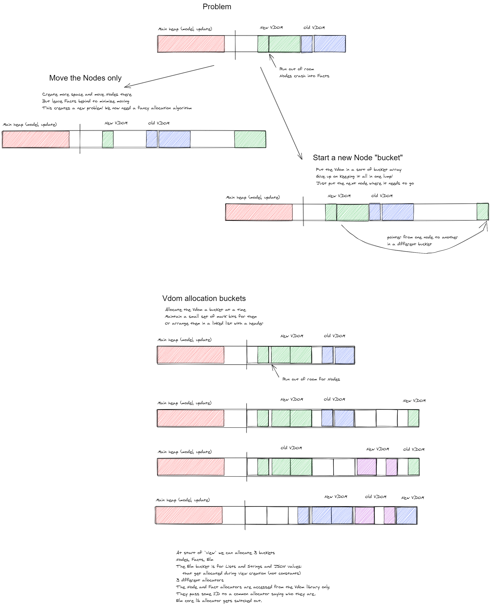

# Multi-region heap / arbitrary layout

- It's a lot nicer than expanding when running on the OS
- Seems more robust and general and stuff
- But am I stretching a Wasm thing too much into an OS thing?

## Allocate
- when next_alloc hits top of region, maybe we start a new region
- do a mark first and if we're >75% live data then start new region

## Mark
- `mark_words`
  - needs to figure out what region it's in to look at the right bitmap
- `mark_trace`
  - could use all regions offset areas for its stack?
  - Basically an outer loop to start a new stack in another region
  - Once that stack is depleted, go back down to the other one
- `mark`
  - when clearing mark bits, needs to loop over all regions

## Compact
- `calc_offsets`
  - needs an outer loop over region
- `forwarding_address`
  - needs to account for region when looking up an offset
- `compact`
  - finding next live/dead patch needs an outer loop over regions
  - main loop needs to keep track of two regions, `from` and `to`


# Linear memory layout

## Non-Wasm platforms
- Linux
  - just use old-school brk, sbrk
  - or give mmap a requested starting address at system_end
  - assert that the actual allocated address matches
- Windows
  - set requested starting address to system_end
  - assert that the actual allocated address matches

## Growing stuff
- growing the heap
  - ask system for more overall memory
  - move the vdom region
  - update GC heap state
- growing the vdom
  - ask system for more overall memory
  - write a new vdom page

## Moving the VDOM
- nodes
  - facts and children are internal => add an offset to each address
  - extras can be heap values => no change
- facts
  - keys are Strings => address doesn't change
  - values are on heap => address doesn't change
- patches
  - never alive when we're moving the vdom
- page metadata
  - doesn't change, just copy to new address


- per-bucket copying
  - for each bucket
    - if it's patches, skip
    - if it's facts, blindly copy N words
    - if it's nodes
      - loop over nodes, calculating size to step
      - how do you know where to start? skip zeros (rely on that)
        - don't want to start at root, it may not be allocated in order
      - break on LINK or END

- tree-based copying
  - copy node tree
    - start at root node
    - traverse the tree


# Virtual DOM

## development approach

- Cachegrind
  - Get a test setup to look at SOA vs AOS and so on
- Simplified example for development, just like in TS
- Bucket Array
  - This is going to be my main data structure so make a library out of it
  - Abstract out the content type (not so easy in C!)
  - What's in it?
    - An area for the data. Big array.
    - A "push" pointer
    - A bucket capacity (explicit? implicit?)

```c
#define BUCKET_SIZE 1024
struct bucket_array {
  void* items[BUCKET_SIZE];
  size_t current_item;
  struct bucket_array *next_bucket;
};

```


### SOA for VDOM?
Might not be the best.
- SOA is optimal for cases where you only operate on one or two fields at a time
- But for vdom diff, typically both vdom's match, in which case we end up comparing all fields anyway.
- SOA gives savings in the case of mismatching tags for example. Avoids loading other fields of the old vdom node.
  - Meh. Not worth code complexity.
- SOA wants indices rather than pointers
  - View code needs references to pieces of UI to manipulate. Don't really want lots of conversions from pointers to indices, or (bucket, index) pairs.
  - Could actually return an `Int` to the app, with an index in it!

### group nodes/facts by type?
OK but we don't really have any operations that get better.


### Interface to elm/browser

`_Browser_element` calls `__Platform_initialize` with a callback called stepperBuilder that uses a few VirtualDom functions.

initial setup:

```js
var currNode = _VirtualDom_virtualize(domNode);
```

(single underscore!?)
Takes the real DOM node from user args

Elm event loop:

```js
var nextNode = view(model);
var patches = __VirtualDom_diff(currNode, nextNode);
domNode = __VirtualDom_applyPatches(domNode, currNode, patches, sendToApp);
currNode = nextNode;
```

domNode: real DOM
currNode, nextNode: virtual DOM

I need to override `__VirtualDom_diff` and `__VirtualDom_applyPatches` with my own definitions
`patches` can be a Wasm address
`__VirtualDom_diff` should be a Wasm export.
currNode and nextNode would in theory be addresses? but GC moving and stuff

```
_VirtualDom_virtualize

  _VirtualDom_text

_VirtualDom_diff

  _VirtualDom_diffHelp
    _VirtualDom_dekey
    _VirtualDom_pushPatch
    _VirtualDom_pairwiseRefEqual
    _VirtualDom_diffNodes
    _VirtualDom_diffKids
    _VirtualDom_diffKeyedKids
      _VirtualDom_insertNode
      _VirtualDom_removeNode
    _VirtualDom_diffFacts
      _VirtualDom_equalEvents

_VirtualDom_applyPatches
  _VirtualDom_addDomNodes
    _VirtualDom_addDomNodesHelp
  _VirtualDom_applyPatchesHelp
    _VirtualDom_applyPatch
      _VirtualDom_render
      _VirtualDom_applyPatchRedraw
      _VirtualDom_applyPatchReorder
        _VirtualDom_applyPatchReorderEndInsertsHelp
      _VirtualDom_applyFacts
        _VirtualDom_applyAttrs
        _VirtualDom_applyAttrsNS
        _VirtualDom_applyStyles
        _VirtualDom_applyEvents
          _VirtualDom_toHandlerInt
          _VirtualDom_makeCallback

_5_: keyed diff stuff
_VirtualDom_applyPatchReorderEndInsertsHelp
_VirtualDom_applyPatchReorder
_VirtualDom_removeNode
_VirtualDom_insertNode (_VirtualDom_diffKeyedKids)
```

## Data-oriented design for virtual DOM

- Assume memory access pattern is the perf bottleneck
- Avoid cache misses

What are the _most common_ data access patterns?

diffing:

- most of vdom has not changed most of the time!
- normally comparing two _identical structures_,
  generated by the same code in the same order, etc
- example common pattern

```elm
  div []
    [ ul []
      [ li [] [text "hi"]
      , li [] [text "hi"]
      , li [] [text "hi"]
      ]
    ]
```

- So data is _likely_ to be allocated depth-first
- But unfortunately we're traversing it top-down
- Maybe allocating it in reverse is not a bad idea!!

applying patches:

- visiting one real DOM node at a time
- once we have it, want to keep it in cache
- most diffs are props

### JS-like data structures

```c
typedef struct {
  VDOM_BASE_FIELDS
  ElmString16* text;
} VdomText;

typedef struct {
  VDOM_BASE_FIELDS
  ElmString16* tag;
  VdomFact* facts;
  VdomNode* kids;
  ElmString16* namespace;
} VdomNode;

typedef struct {
  Header header;
  u32 ctor;
  ElmString16* key;
  void* value;
  ElmString16* namespaces[]; // 0 or 1 element
} VdomFact;

typedef struct {
  VDOM_BASE_FIELDS
  Closure* tagger;
  VdomNode* node;
} VdomTagger;

typedef struct {
  VDOM_BASE_FIELDS
  VdomNode* node;
  void* refs[];
} VdomThunk;

typedef struct {
  VDOM_BASE_FIELDS
  Cons* facts;
  void* model;
  void* render;
  void* diff;
} VdomCustom;

typedef struct {
  Header header;
  u8 ctor : 4;
  u32 index : 28;
  void* data;
} VdomPatch;
```

### SOA/layout ideas

- There are lots of strings so we probably need a strings section of the Vdom
- Could make Vdom a structure of arrays, including a string array and a random shit array
- Use growable arrays. We could start off the next Vdom with the same sizes as the previous one
- The _whole Vdom_ could look like a single Elm value to the GC
- Use indices instead of pointers for easy moving around
  - no adjustment on resizing the growable array
  - easy to move the whole thing
  - maybe use 24 bits and get 8 back for other stuff
- If current `update` bumps into the previous Vdom then move the whole Vdom (memcpy)
  - It will naturally migrate up to where that tends not to happen
- Vdom structure should probably have an array of pointers to main heap
  - Faster marking
  - a layer of indirection could be handy when moving stuff

### Allocating in reverse

- Tricky when the API is linked-list based!
- Hardware is just as good at spotting downward patterns though

### Database-style normalization

Exercise recommended by the [Data Oriented Design book](https://www.dataorienteddesign.com/dodbook/node3.html)

text nodes

| col   | type      |
| ----- | --------- |
| value | string ID |

nodes

| col                | type            |
| ------------------ | --------------- |
| tag                | string ID       |
| namespace          | string ID       |
| nFacts / nChildren | int (10,22)     |
| facts              | Fact mapping ID |
| children           | Node mapping ID |

keyed nodes

| col                | type            |
| ------------------ | --------------- |
| tag                | string ID       |
| namespace          | string ID       |
| nFacts / nChildren | int (10,22)     |
| keys               | string ID       |
| facts              | Fact mapping ID |
| children           | Node mapping ID |

node-node mapping table
node-fact mapping table

tagger nodes

| col    | type         |
| ------ | ------------ |
| node   | node ID      |
| tagger | Elm value ID |

thunk nodes

| col    | type         |
| ------ | ------------ |
| nRefs  | int          |
| refs   | Elm value ID |
| tagger | Elm value ID |
| node   | node ID      |

events (`on`) & properties

| col     | type         |
| ------- | ------------ |
| key     | string ID    |
| handler | Elm value ID |

style & attr

| col   | type      |
| ----- | --------- |
| key   | string ID |
| value | string ID |

attrNS

| col   | type      |
| ----- | --------- |
| key   | string ID |
| value | string ID |
| NS    | string ID |

### converting lists to arrays

The developer API for Vdom is list-based but a list only contains _pointers_, not the values themselves! The actual Vdom values can all be allocated in their own heap region, without the lists. Can easily compress the list into a C-like array.

### Normalized-ish data-oriented structure, round 2

Maybe there's no point in splitting up all the different bits.
From a cache perspective we are only going to traverse in top-down tree order.
We're never going to iterate over all divs or all event handlers
This also means we can't really help instruction cache using loops
As soon as we load the instructions for doing event handlers, we generally find we only have one of them! So we do it, and then jump to some other routine.

So just chuck everything in together in tree order
Maybe allocate in reverse
Have an array of pointers to non-Vdom values
Use relative pointers generally
Try to put variable-length stuff at the end of the struct, maybe with a few indices into it.

**BUT** we do actually lose some space due to all the header type tags and stuff.

```c
typedef struct {
  void* heap_refs;
  VdomValue* tree;
} Vdom;

```

"custom" nodes exist in the source but not used anywhere in Elm core

text nodes

| col         | type            |
| ----------- | --------------- |
| type & size | enum & int      |
| value       | Elm value index |

nodes

| col                | type            |
| ------------------ | --------------- |
| type & size        | enum & int      |
| tag                | Elm value index |
| namespace          | Elm value index |
| nFacts             | int             |
| factsAndChildren[] | Vdom indices    |

keyed nodes

| col                    | type                     |
| ---------------------- | ------------------------ |
| type & size            | enum & int               |
| tag                    | Elm value index          |
| namespace              | Elm value index          |
| nFacts                 | int                      |
| factsKeysAndChildren[] | Elm value & Vdom indices |

tagger nodes

| col         | type            |
| ----------- | --------------- |
| type & size | enum & int      |
| tagger      | Elm value index |
| node        | Vdom index      |

thunk nodes

| col         | type              |
| ----------- | ----------------- |
| type & size | enum & int        |
| node        | Vdom index        |
| thunk       | Elm value index   |
| refs[]      | Elm value indices |

events (`on`)

| col         | type            |
| ----------- | --------------- |
| type & size | enum & int      |
| key         | Elm value index |
| handler     | Elm value index |

style & attr & properties

| col         | type            |
| ----------- | --------------- |
| type & size | enum & int      |
| key         | Elm value index |
| value       | Elm value index |

attrNS

| col       | type            |
| --------- | --------------- |
| key       | Elm value index |
| value     | Elm value index |
| namespace | Elm value index |

### example memory layout

```elm
ul []
  [ li [style "color" "red"] [text "hello"]
  , li [style "margin" "auto"] [text "world"]
  ]
```

Execution order

- style "margin" "auto"
- list create
- text "world"
- list create
- li create
- style "color" "red"
- list create
- text "hello"
- list create
- li create
- list create
- ul create

Removing the lists

- style "margin" "auto"
- text "world"
- li
- style "color" "red"
- text "hello"
- li
- ul

### allocate forwards

| idx | field               | type            | value     | diff order |
| --- | ------------------- | --------------- | --------- | ---------- |
| 0   | type (size)         |                 | style (3) | 3          |
| 1   | key                 | Elm value index | "margin"  |            |
| 2   | value               | Elm value index | "auto"    |            |
| 3   | type (size)         |                 | text (2)  | 4          |
| 4   | value               | Elm value index | "world"   |            |
| 5   | type (size)         |                 | node (6)  |            |
| 6   | tag                 | Elm value index | "li"      | 2          |
| 7   | namespace           | Elm value index | -1        |            |
| 8   | nFacts              | int             | 1         |            |
| 9   | factsAndChildren[0] | Vdom index      | 0         |            |
| 10  | factsAndChildren[1] | Vdom index      | 3         |            |
| 11  | type (size)         |                 | style (3) | 6          |
| 12  | key                 | Elm value index | "color"   |            |
| 13  | value               | Elm value index | "red"     |            |
| 14  | type (size)         |                 | text (2)  | 7          |
| 15  | value               | Elm value index | "hello"   |            |
| 16  | type (size)         |                 | node (6)  | 5          |
| 17  | tag                 | Elm value index | "li"      |            |
| 18  | namespace           | Elm value index | -1        |            |
| 19  | nFacts              | int             | 1         |            |
| 20  | factsAndChildren[0] | Vdom index      | 11        |            |
| 21  | factsAndChildren[1] | Vdom index      | 14        |            |
| 22  | type (size)         |                 | node (6)  |            |
| 23  | tag                 | Elm value index | "ul"      | 1          |
| 24  | namespace           | Elm value index | -1        |            |
| 25  | nFacts              | int             | 0         |            |
| 26  | factsAndChildren[0] | Vdom index      | 5         |            |
| 27  | factsAndChildren[1] | Vdom index      | 16        |            |

### allocate backwards, diff forwards

oh actually yeah, this is better
order of args is unfortunate...
could choose to evaluate args backwards in the language implementation generally...
or store facts in a different region

| idx | field               | type            | value     | diff order |
| --- | ------------------- | --------------- | --------- | ---------- |
| 0   | type (size)         |                 | node (6)  | 1          |
| 1   | tag                 | Elm value index | "ul"      |            |
| 2   | namespace           | Elm value index | -1        |            |
| 3   | nFacts              | int             | 0         |            |
| 4   | factsAndChildren[0] | Vdom index      | 6         |            |
| 5   | factsAndChildren[1] | Vdom index      | 17        |            |
| 6   | type (size)         |                 | node (6)  | 2          |
| 7   | tag                 | Elm value index | "li"      |            |
| 8   | namespace           | Elm value index | -1        |            |
| 9   | nFacts              | int             | 1         |            |
| 10  | factsAndChildren[0] | Vdom index      | 12        |            |
| 11  | factsAndChildren[1] | Vdom index      | 14        |            |
| 12  | type (size)         |                 | text (2)  | 4          |
| 13  | value               | Elm value index | "hello"   |            |
| 14  | type (size)         |                 | style (3) | 3          |
| 15  | key                 | Elm value index | "color"   |            |
| 16  | value               | Elm value index | "red"     |            |
| 17  | type (size)         |                 | node (6)  | 5          |
| 18  | tag                 | Elm value index | "li"      |            |
| 19  | namespace           | Elm value index | -1        |            |
| 20  | nFacts              | int             | 1         |            |
| 21  | factsAndChildren[0] | Vdom index      | 23        |            |
| 22  | factsAndChildren[1] | Vdom index      | 25        |            |
| 23  | type (size)         |                 | text (2)  | 7          |
| 24  | value               | Elm value index | "world"   |            |
| 25  | type (size)         |                 | style (3) | 6          |
| 26  | key                 | Elm value index | "margin"  |            |
| 27  | value               | Elm value index | "auto"    |            |

## More GC thoughts for Vdom region

The different arrays in the Vdom could move around relative to each other
as they grow...
But we need some simple mental model of it
I know exactly how many things I have, and each is contiguous,
so mark/sweep stuff is really easy
But in this system, allocation is the issue, we're not bumping anymore

```c
typedef struct {
  u32 nodes_alloc;
  u32 nodes_size;
  u32* nodes;

  u32 facts_alloc;
  u32 facts_size;
  u32* facts;

  u32 heap_refs_alloc;
  u32 heap_refs_size;
  void** heap_refs;
} Vdom;
```

## Non-TEA crazy edge cases
App devs can do stupid things that nonetheless have to work in the language semantics.

### Creating Vdom nodes from the update function
In case someone calls `div` from `update`, we have to make sure that the Vdom functions are using the main heap allocator during that time.
Need to structure it to be swappable.
Vdom constructors need to have an extra `if` even for normal use, which is unfortunate.

### Passing Vdom nodes into update via event handlers
When someone gives us a Closure for event handling, we need to trace it for Vdom nodes and copy them to the main heap if we see them.

> This made me give up on strictly keeping all Vdom values in the Vdom arena. Either we allow them in the heap or we have some other place. But we then have to compact that area during main heap compaction anyway...
> Also it's hard to get away with using indices instead of pointers, since we have to pass Vdom to lists at least.


# Memory management with regions



- At start of `view` we can allocate 4 buckets:
  - Nodes, Facts, patches, Elm
- The Elm bucket is for Lists and Strings and JSON values that get allocated during view creation (not constants)
- 3 different allocator functions
  - The Node and Fact allocators are accessed from the Vdom library only.
  - They pass some ID to a common allocator saying who they are.
- Elm core lib allocator gets switched out for this new one during `view`

## Top level memory manager
- when main heap runs out of room, we have two choices
  - if there's some free buckets at the bottom of vdom, take them now and request more memory later
  - get more memory and move the whole vdom area up


=======
# Build system

## Port to Windows
- So I can do debugging more easily
  - gdb is awful and VS Code on WSL is not good.
- GC will need Windows heap allocation https://docs.microsoft.com/en-us/windows/win32/api/heapapi/nf-heapapi-heapcreate

Steps
1. Rewrite "GC Full" handling
  - Needed for Microsoft compiler compatibility since my custom exception thing uses non-standard GNU-C "statement expression".
  - use standard longjmp instead of basically rolling my own version of that.
    - Emscripten says that longjmp and C++ exceptions are v expensive. But my thing is the same so also slow!
    - This is really the cost imposed by Wasm for not being able to examine stack or registers.
  - redo string growing for Debug.toString and Json.encode
    - need to update the size every time, can't capture the exception value anymore
  - check everywhere with `GC_malloc(false, x)` for similar size update stuff
  - Get rid of CAN_THROW
2. Get compiler to work with new "GC full" stuff
3. Get GC working on Windows
```c
#include <heapapi.h>
size_t heap_init_bytes = GC_INITIAL_HEAP_MB * 1024 * 1024;
HANDLE hHeap = HeapCreate(0, heap_init_bytes, heap_init_bytes);
void* heap = HeapAlloc(hHeap, 0, heap_init_bytes);
```


## Speed up
- "Unity build"
  - Have a core.c that includes all the other core .c files in one translation unit
  - Move all the header file stuff into core.h
- Precompiled headers
  - .pch files for things like types.h

## Lib paths
- remove the need for code mods


# Replay rewrite


## Notes after stack map v3, before v4!

Things are a lot better, but not there yet. Gradually learning what I really need!
This keeps getting closer to a normal stack structure and needs to go a bit further.
Currently:
- I have a value stack that I push all allocations to. This is good.
- Plus a separate call stack to track what function I'm currently in, "for debug only"...
- Also Kernel code is now forced to admit to any tricks like dynamically growing arrays/strings/etc.
- Ended up building some extra stuff "for debug":
  - an array of flags: returned vs allocated data (it's a data-oriented SOA design actually, which is nice)
  - a call stack beside the value stack
    - using this for various sanity-checking assertions
    - but those are complicated and confusing now
  - I am now trying to figure out how to get these to agree with each other in edge cases
    like the very first call in normal or replay mode, etc. The value stack is labelled with function pointers
    but those may or may not match the call stack. What am I doing?
- Still not passing args via the fake stack!
  - The only part of the standard stack setup that I am still avoiding... will I regret this too?
  - If I use an explicit stack to pass args, the C code just gets horrible. Lots of wasted loads and stores. And kernel code is really hard to write/maintain.
  - I don't want to block registers from being used to pass args some day.
    - Currently preventing that by using arg arrays!
    - But the door is open to refactor eval functions to use varargs, and to inline saturated function calls.
- I do want stack frames to keep everything together
  - Keep the flags array idea. Introduce a "start of frame" flag and put the eval function pointer there.


## Notes after stack map v2, before v3!

- Assertion testing: sprinkle assertions everywhere and then run some functions
- Currently only triggering within gdb
  - One section is starts one word too early, or maybe 2 too late
  - It's partway through an infinite_loop Closure
  - It's out of sequence with the other live sections which are mostly monotonically increasing
- old infinite loop sections seem to be kept alive! stack map should be shallower

This is still a pain to debug, I can't tell what the hell is going on
"Live section" is just not a nice mental model of this
I think the main reason I'm doing it as an actual stack is to avoid having trouble with kernel
shenanigans like growing arrays after allocating them and so on.
BUT what if instead of using GC_malloc to push to the stack, I use the constructors?
There's only a few of them.
Even with shenanigans, the constructor only gets called once.

So that allows me to use a stack structure which should be easier to get right
I don't really need to track which parts are from which functions but it would be nice!
Maybe separate call and value stacks

What to do with tailcalls?
  - At the top of the loop, inside it, do NEW_CLOSURE(stuff)
  - Assign the arguments from the Closure, not from args
  - On replay this will be a fake replayed allocation with the right stuff in it
  - Boom, that's it
  - There's no situation where you actually want to return the full Closure. It's always a local.


## Notes before building stack map v2

- replay/stackmap is so hard to debug
- stack map is mixed through the rest of the stuff
- I really need a separate region. Something small will do.
- Explicit stack is sounding so good right now.

- Do a rewrite
  - stack map off to the side:
  - add every allocation to it
  - when the call returns, write that as the only pointer for this call
  - the _overwriting_ is key to keeping it small and simple and current

```c
typedef struct {
  void* (*evaluator)(void**); // for debug
  void* start;
  void* end;
} GcLiveSection;
GcLiveSection live_sections[1024];
i16 current_live_section;
i16 replay_live_section;
void* replay;
Closure* entry;
```

- run mode
  - evalClosure
    - live_section_index = 0
    - replay_section_index = -1
    - initialise live_sections[0]
    - entry = closure
    - Utils_apply

  - Utils_apply
    - write to current live section end=alloc_next
    - create a new live section with start=alloc_next, end=heap->end, and save a reference to this (will pop to it later)
    - evaluate the call
    - either
      - exit normally
        - overwrite the live section I created, to just contain the return value
        - create a new live section for parent's allocations, and set as current, with start=alloc_next, end=NULL
      - exit with GC full
        - nothing to do... could write to end but that's someone else's job and why bother
  - GC_malloc
    - check heap overflow _and_ live section overflow
    - if live section overflows... we're fucked I think
      - it's NOT possible to compress the live sections after compressing the heap!
        - except in the simplest case where the returned value has no children
        - because we're iterating up the headers
      - might want to allocate another page for this if it overflows.. but 64kB is thousands of calls deep (16k pointers)
      - but no real need for buckets, just unmap the current thing and request twice as much

- GC
  - mark the entry point
  - loop over the live sections
    - within each section, iterate using header sizes
      - **Gaps are a disaster**
      - Maybe we need a GC function to mark stuff as (sized) garbage.
      - need to audit the kernel code for any shenanigans leaving gaps
  - compress
  - update stackmap & entry with relocated pointers

- replay mode
  - refactor so evalClosure is in the GC module rather than passing control back
  - set replay mode
    - need two stackmap indices, replay and real. When replay gets to real, exit replay mode.
  - Utils_apply
    - call GC_stack_push_frame
    - if NULL, continue
    - if not, 
  - GC_stack_push_frame
    - check if replay mode, if not return NULL
    - assert that the section is one pointer wide (hmm unless we are merging live sections after compression)
    - bump replay to next live section and update its pointer
    - return saved value
  - GC_malloc
    - Check if in replay. If not, do as normal
    - get replay pointer
    - bump replay pointer by size requested
      - if gone past current live section end, bump index & ptr to next live section (this is like a bucket array)
      - if replay index gone past live index, exit replay
    - return old value of replay pointer

- tail call functions
  - runtime
    - should just allocate a Closure on entry and on tailcall, stop messing about
    - on tailcall, mutates its own _first_ live section in the stackmap to start at the latest closure
      - needs to reset its _first_ live section, not just the current live section. That requires a ref, like the existing implementation.
      - could get that ref using an outer TCE wrapper, or with a GC function call before the `while`
      - allocating unneccessary closure at start? could test address just below args array to see if it's a Closure pointing at this eval fn. hackology. Will go wrong, don't.


# Other GC improvements

## Heap regions
- would enable all sorts of fancier GC stuff: the vdom region, dynamically growing improved stackmap
- allocation
  - when we overspill the current region, bump next_alloc up to next region
- mark
  - needs to know which region it is updating the mark bits for
  - ignore_below might be more complex if region addresses can be out of order.. but compaction should avoid that
- compact
  - `to` pointer has to jump over the gaps between regions
  - compaction gets an extra outer loop over regions
- state
  - doubly linked list of regions
  - each region looks roughly like what our current heap struct is. Maybe that's the region header.

# Enable modulo cons mutation
- special region
  - not compacted, can support limited local mutation with the freshest values
  - instead of compact, use a depth-first copy (it's a bit like a mark and compact in one)
  - need somewhere to copy into - the newest non-nursery region needs to have room, or if not, we create a new region
  - if we're still running then don't copy the very freshest thing in case it gets mutated.
  - actually couldn't that happen at any level of the stack? like in List.map the mapper could generate a massive pile of garbage.
  - so the rule would have to be that the whole young generation uses copy instead of compact until its call is finished
  - the thing is, this is unbounded really... and you **need a way to tidy up during execution. How does that work in this scheme?** Ends up being semi-space?
  - I'm not sure if there's actually a way to have one section with mutation and one without...
    - Probably can, if you grow the copying space indefinitely until the call ends

- stack-based mutation?
  - can it work?
  - nope! Too much stuff. We're going the wrong way down the list so of course you get old-to-new pointers

- just do something else that's almost as fast
  - still perform all the work on the way down the list
  - put each result pointer into a bucket list of temporary arrays
  - keep a count of the list length
  - at the end, create a list of that length and fill it from the bucket array
    - content will be in reverse order from the cons cells (but then modulo-cons has weird heap shape too)


# Prevent stack overflow in mark algo for deep structures
- Reuse offset area for a "work list" as the GC Handbook calls it
- As you visit each node, mark it, and mark its children
- Move to first child, putting the other children in the worklist
- When you get to the bottom, grab something else from the work list
- If you ever run out of worklist space, bail to a slower algo
  - Linearly march a cursor through the mark bitmap, looking for stuff that is marked but has unmarked children
  - But now we can no longer assume that a marked object has all marked children
  - So when tracing these partially-traced things, only put their children in the worklist if they are below the cursor
  - If not below cursor, we'll get to them later - we'll find them in the bitmap!


# Recording/streaming issues
- switching windows
- I'm mumbling
- slow build time
- doing too hard a task


# Generate Wasm encoder for Msg

- Solves Int/Float ambiguity
- Use debug types carried around in the Main values in compiler
- Need to transform the `update` in the record passed to the Program constructor function
- If done in Elm this would use an extensible record type annotation
- While we're at it, store the model as a GC root
  - Need some part of the transformation to be on the Wasm side
- Encoder function has to be in JS

- execution

  - program loads
  - JS wrapper reads the Program closure out of Wasm
  - Program closure contains an unevaluated call to `_Browser_application` or simliar
  - The argument to `_Browser_application` is also an unevaluated call to the generated TEA record transformer in JS

- Limitation to accept: I still have just as many 'border crossings' but now one of them works properly. Two separate problems.

- How does `update` work now?

  - Read out the Program from Wasm to JS
  - It is a kernel Closure with one arg, the TEA record, containing functions
  - Those functions turn into wasmCallbacks
  - Browser package does its thing
  - Calls update wasmCallback with a JS model and a JS message
  - wasmCallback encodes the model, the message, any free vars, and a Closure
  - call evalClosure
  - get an address back
  - decode Wasm to JS
  - return JS value to the caller

- How will it work?
  - Read out the Program from Wasm to JS
  - It is a kernel Closure with one arg, the TEA record
  - The update field of the record is a kernel Closure that calls `wrapUpdate`
    - It gets evaluated on read before `_Browser_application` gets called
    - `wrapUpdate` is a compiler-generated function
    - One of its args is the user's update Closure. If user update has free vars, they get decoded
    - It may have a free var saying which `main` it belongs to?
    - returns wrapped update JS function
  - Browser package does its thing
  - Calls wrapped update with a JS model and a JS message
  - wrapped update encodes the model, the message, any free vars, and a Closure
  - call evalClosure
  - get an address back
  - decode Wasm to JS
  - return JS value to the caller

# Keep model in Wasm

- update has two closed-over numbers
  - model: GC root fixed address
    - Better than closing over on Wasm side. If we have two mains, one can trigger a GC that would move the other one's `update` closure address. Yuck.
  - update: Wasm Closure address
    - This will be the _Wasm wrapped_ update
    - It holds a closed-over reference to the user-defined update function (partially applied on load)
- receives JS msg and (dummy) model
- writes directly to Wasm memory
- calls the Wasm update with written Msg and model GC root addr
- Wasm side dereferences the GC root and

- If we're playing games with the model, we need to transform all TEA functions that use it!

  - `subscriptions`, `init`, `view`
  - At a minimum, they need to dereference things

- init
  - `_Platform_initialize` calls it with flags value, which could be Elm or JSON
  - JS init fn. args: JS flags, return: ( modelID, Cmd Msg ). Encodes flags to Wasm.
  - C init wrapper. args: Wasm flags, return ( modelID, Cmd Msg ). Stores model in GC root.
  - Elm app init. args: Wasm flags, return ( model, Cmd Msg )
- update
  - `sendToApp` calls it with Msg and modelID (or appID?)
  - JS udpate fn. args: JS msg & modelID, return: ( modelID, Cmd Msg ). Encodes msg to Wasm.
  - C wrapper. args: Wasm msg & modelID, return ( modelID, Cmd Msg ). Retrieves and stores model in GC root.
  - Elm app update. args: Wasm msg & model, return ( model, Cmd Msg )
- subscriptions/view
  - `sendToApp` calls it with modelID (or appID?)
  - JS subs fn. args: JS modelID, return: Sub Msg. Encodes msg to Wasm.
  - C subs wrapper. args: Wasm modelID, return Sub Msg. Retrieves model from GC root.
  - Elm app subs. args: Wasm model, return Sub Msg

GC root

- easiest if there's just one: an array of app data (JS fake model is its index)
- The entry for each app is a tuple/custom of
  - model
  - init
  - update
  - subs
  - view

# Avoid decoding Msg from Wasm to JS only to re-encode it again

- requires some sort of WasmRef like the JsRef
- use the same implementation?
- Wasm array (Custom) of things that we have sent out to JS
- or at least Msg values generated by Msg constructors!!
- treat them as one-in-one-out? As soon as it gets read, we dump it?
- or get the update function to dump it?

- Feels like a bit of a risk though. If we have a cache miss, we're fucked.
- can JS hold on to a Msg _value_ for a long time?
- If you did Time.every and made it give you

# Replacing Json.js

References from other JS code

| Function        | Usages                           | Comment                  |
| --------------- | -------------------------------- | ------------------------ |
| Json_decodePrim | File.js                          | unserialisable JsRef     |
| Json_expecting  | File.js                          | write Err to Wasm        |
| ----            | ----                             | ----                     |
| Json_equality   | VirtualDom.js                    | diff event decoders      |
| Json_runHelp    | VirtualDom.js, Browser.js        | event handler callback   |
| Json_map(2)     | VirtualDom.js, Browser.server.js | map msg of event handler |
| Json_succeed    | VirtualDom.js                    | map msg of event handler |
| Json_unwrap     | VirtualDom.js                    | apply DOM node props     |
| ----            | ----                             | ----                     |
| Json_run        | Platform.js, Browser.server.js   | flags                    |
| Json_wrap       | Platform.js,                     | flags, send??            |
|                 | Debugger.js, Browser.server.js   | flags                    |

So there are just a few situations

- App init flags
- File/Bytes decoder
- DOM events
  - equality on message handler decoders
  - map msg of event handlers
  - decoding events

The first two are straightforward enough

## DOM events

`_VirtualDom_on` is a constructor in the Custom type for Facts

```js
var _VirtualDom_on = F2(function (key, handler) {
  return {
    $: 'a__1_EVENT',
    __key: key,
    __value: handler
  };
});
```

The Json decoder is in the `handler` field:

```elm
on : String -> Handler msg -> Attribute msg

type Handler msg
  = Normal (Json.Decoder msg)
  | MayStopPropagation (Json.Decoder (msg, Bool))
  | MayPreventDefault (Json.Decoder (msg, Bool))
  | Custom (Json.Decoder { message : msg, stopPropagation : Bool, preventDefault : Bool })
```

All variants of `Handler` have one argument - the decoder.
When run, it returns a message + (DOM options used in the VirtualDom callback)

So what we want is to decode the Event without doing a bonkers amount of JS/Wasm back-and-forth
What's the minimum imaginable?

## Decoding unserialisable things

- The easy part: string, number, boolean and null just get sent through the JS/Wasm wrapper

- Objects

  - What we care about is the `field` decoder
  - `keyValuePairs` doesn't work on unserialisable data in standard Elm, so just write it to Wasm as JSON_VALUE_OBJECT
  - 2 params: `field` and `decoder`
  - The JS side needs the field string and some way of referencing the decoder
  - Obviously it also needs to know the `ctor` of the decoder to match on it

- Arrays

  - could be self-referential and the decoder could skip the self-referential index...
  - We care about the `index` decoder here. Takes and index and a decoder

- run
  - never send the decoder across the border
  - Just call a few imported functions to do basic ops on JS values
    - get_field
    - get_index
    - get_json_string or get_value?

````

Assume we have inifinite memory and there are no GC issues

## the hard part

- The border crossings are a direct consequence of trying to avoid long-lived refs between JS and Wasm
- To get rid of them we absolutely have to have a mechanism for JS-to-Wasm refs

## JS to Wasm refs

- Need a Wasm value representing an inbound ref from JS
- A GC root has some list or tree underneath it of all inbound refs
- Also some persistent ID

### what's the inverse of the Wasm-to-JS refs?

Wasm-to-JS

- a Wasm value containing a fixed number ID for the JS value
- a way to look up that ID on the JS side
- an array on the JS side that gets told by Wasm what's alive or dead

JS-to-Wasm

- a JS value containing a fixed number ID for the Wasm value `new WasmRef(addr)`
- a way to look up that ID on the Wasm side
- an array on the Wasm side that gets told by JS what's alive or dead

# Status 29 Apr 2020

## SPA example bugs

- Stack overflow on the HTTP response, in Json Decode
- URL string for the HTTP call is mangled
- Saw a dynamically generated FieldGroup with 0's for field IDs

# JSON issues

When you call `Json.Decode.decodeString` you get back a suspended thunk, not a decoded Elm value!
There's some code in the SPA example that then does a `case` on the decoded value, expecting it to be a custom type.
But it's not, it's a thunk. We haven't called out to JS yet. Oops!
The system I've built only really works for `Cmd`s. If Elm code tries to work on the suspended call, it breaks.

Need to implement the JSON library somehow

## Fix for serialisable values only

Always take JSON values as strings.
Write a parser for the string into some Custom type representing JSON
Write all the JS kernel bits in pure Elm, compile it to C
But this will run into trouble as soon as we get to HTML Events and so on.

## Quick, inefficient fix to get HTTP working

Import one particular JS function and call it synchronously
- reads your decoder and your _string_ to decode
- converts decoder thunks and whatnot
- Writes the result back
- So it's a synchronous thunk evaluator. Just readWasmValue and write back the result.
​```js
var wasmWrapper;
const imports = {
  evaluateInJs: addr => wasmWrapper.writeWasmValue(
    wasmWrapper.readWasmValue(addr)
  )
}
````

- I will currently use it only for Json.Decode.decodeString but it's a general thing.
- The simplest way to fit it into the current architecture is to write C kernel for all the JS stuff. They can mostly be the same as what the compiler would have generated. But `decodeString` and maybe some other stuff call out to `evaluateInJs`.
- the wrapper needs to assign an ID to `decodeString` even though we're now generating it in C `kernelFuncRecord`
  - we can just be overcautious and add one for every single function in that kernel module, just in case we need it. It's zero size in Wasm and small in JS.
  - However we want to prevent the compiler from generating the Closure thunks! We may want to override those with our own stuff.

### Compiling synchronous JS calls

Random list of considerations:

- writing everything in C
  - every Closure we generate needs an enum entry JS_Json_thing
  - if I manually write all the Closures then how do I force the compiler to add _all_ the enum entries? Even unused.
  - just have a set of predefined ones? Or make it part of adding that kernel? it's a bit yuck
  - if they are `extern` then they are not compile-time known, so need to be initialised.
- generating most stuff as normal
  - how do I make exceptions for Json_run and Json_runOnString?
  - exceptional code gen for the call
    - not really good enough, only accounts for simple saturated calls. Partial application and `>>` would break.
  - exceptional code gen for a reference
    - yep that's the ticket
    - Expression.hs, `Opt.VarKernel home name ->`
      - this has a simple expression right now but make it more complicated
      - instead of just having a `Set` of modules, make a full `case`. Look at name as well as home.
      - for the C-implemented stuff, don't generate any code.
        - So the compiler has special info about what exists in Json lib, which is not core. Well sort-of not core! It's already pretty special TBH. Used for flags and ports and things.

## Fully general solution (incl. circular structures)

### Garbage collection of JS references

- Use mark-sweep, non-moving
  - It simplifies the Wasm side if we don't have to change IDs
  - JS side is pretty simple
  - Wasm side is pretty simple too actually. Just import markJs(id) and sweepJs()

### Json.Value in C

Need a new tag for this, which is annoying cos I'm out of bits
Maybe free up some space by redesigning the GC book-keeping. Use ctors instead of tags to distinguish them.
Or redesign Lists and Tuples to be the same as Custom, get rid of the index function

### Actual JSON decoding

To decode a value, get a JsRef to it

- how does the wrapper know what to pass to Wasm as a Json.Value?
- where can Values come from?
  - HTML events
  - ports
  - Cmds
- need to catch this kind of `Value`s on the way from runtime to Wasm - wrap it in a some WasmJsRef() constructor - don't run the wrapper conversion on it - instead, push it onto the JsRef array
  OK so if I can figure all that out, then what?

* Decoding a string

call out to JSON.parse, then decode a Value. Cos the value is harder

- Decoding a value

Somehow get a JsRef in Wasm containing an index into a JS value store
Json.Decode doesn't say "what are you?". It says "you should be a string", and produces either Ok or Error
Need something like `_Json_runHelp` on the JS side.

Main difference: the return value gets encoded to binary Elm, wrapped in Ok/Error
Nested decoder functions are all Wasm callbacks
Equivalent data structures are defined on both sides (just like the other Elm structures!!)
You build up a decoder in Wasm, then call out to JS to execute it

What do we actually gain by building the data structure in C?

- Constructor functions are all in C
- No back-and-forth just to create the decoder, only to run it
  - Could also reduce for run by just returning a dummy WasmRef
  - This would mean you run your combining functions all in C
  - But this has GC issues
    - Would need some indirection for addresses in case there's a GC during JSON decoding.
    - Make a list of all the Elm values we're constructing
    - When JS requests a Wasm collection to be constructed, it will refer to list indices
    - But while building it on the Wasm side, we translate to real addresses
    - Could be an exported C function that mutates the structure in place
- Becomes version-dependent. Constructor tags change between Json 1.0.0 and 1.1.2

---

# Bad code gen for case expressions

Some case expressions can `goto` a default clause.
JS uses early return but it also can wrap those in IIFE's if needed. I can't. So if I use early return I'll run into other edge cases.

We need a `do ... while(0)` with `break`s in the "other", non-goto branches.
The final (labelled) default clause should be inside the while.
That way, we can "early break" out of the block rather than early return.

# Dynamic field groups

Some field groups are not known to the code gen at compile time!
HTTP response for example.
SPA example has this issue. No Elm code ever creates a Response record. Only JS kernel code does.
This means the wrapper can fail to find the right fieldGroup and it ends up being a NULL.
Need to be able to create FieldGroups dynamically if we don't find them.
But this means they end up in the heap, which means they need to become first-class citizens and get a header with a tag.
Good job we already have one handy, Tag_Unused
TODO

- Change Tag_Unused to Tag_FieldGroup
- Make sure GC `child_count` gets the right answer (0)
- Make sure that equality still works OK on records

# Ports bug (FIXED)

Generated code is trying to recreate each port every time is used, and it breaks.
Need to rework how JS values are referenced from Wasm.
Currently it assumes I can recreate a value as many times as I want and it's OK. (Because pure functional yadda yadda.)
But in the case of a port it is a long-lived _instance_. Trying to recreate it again throws an error.

I need to generate it on the JS side and then reference that instance.
Probably need to do the same for (other) Effect Managers. Am I doing that already?

Naming issue:
The array of JS values currently assumes they are all following the kernel naming convention but ports follow the Globals naming convention. Need to change how that Set works.

# JS arrays passed into Wasm!

Some core packages are using their own weird JS data structures
that contain arrays. `Json` is one of them.
It's probably best to leave JSON decoding in JS.

- It can handle non-serialisable objects
- It handles JS edge cases like NaN, Int vs Float ranges, etc.
- There's a lot of code. The C version would be buggy!
  How to model JS arrays using what we have already?

Feck, they also have numeric $ constructors
$: 13
encode as -14 => Uint32Array 4294967282
read back 4294967282, this should go into the ctors enum object
{
4294967282: 13,
}

Don't really need the 13 as a key

- `Record`

  - This is how the wrapper currently treats them, with 0 fieldgroup (coerced into the ArrayBuffer from `undefined`.)
  - Special case:
    - Reading. Detect NULL pointer in FG and decode to array instead of object
    - Writing: no special case
  - Downside:
    - we have NULL pointer in C. Shouldn't matter because no code should touch it. But I have _some_ out of bounds issue somewhere and I can't eliminate this if it's still hanging around.

- `Custom`

  - Naturally looks like an array
  - Special cases:
    - Writing: type detection & Custom writer
    - Add CTOR_JS_ARRAY to ctors
    - Custom reader: detect CTOR_JS_ARRAY, make an array.
  - Upsides:
    - ctor field is a number, not a pointer
    - easiest mental model

- `Closure`
  - Suspended call to the "kernel" JS function, the Array constructor.
  - Special cases:
    - Writing: Detect type, make it look like a wasmCallback
    - Reading: no special case
  - Upsides:
    - Puts it in the Kernel section where it makes sense to be!
    - Marked NEVER_EVALUATE, which is nice
  - Downsides:
    - A bit too clever
    - Array constructor function needs to be curried, but also needs to be of arbitrary length... agh, need a few of them

# Elm code layer within the core?

Problem:

- Need the C kernel to have the exact same API as the JS kernel, but C is a pain to write and debug.
- A lot of the kernel functions in Elm.js are delegating directly to JS built-ins that we'd have to rewrite in C.

Solution:

- Implement more of the Kernel functions in Elm, built on top of really fundamental C functions
- Pre-compile those Elm modules and bundle the result with the core C lib
- Can use a dummy app to provide an Elm `main`. It can have a folder per core module.
- Extract the compiled C functions out of that dummy app. Ideally using some build script.
  - Run a pattern matcher on the C text, grab what we need
  - leave behind the dummy app stuff and the actual handwritten C kernel stuff
  - Write it all out to a generated.c file that gets included with the kernel lib
  - End of the eval function is the next line that begins with `}` rather than whitespace
- Approaches
  - Node script (really dumb, just count parens and brackets)
  - Haskell Language.C (Proper parsing, filtering and writing out again)

# Get repo in a less-embarrassing state

- Fix compiler errors for new functions
- Sort out branches
  - Roll back `master` to some working state, maybe the wrapper demo
  - Revive `develop`
  - Make a `feature/elm-spa-example` since it's not working yet

# Issues to create

## C kernel

- Unit tests for new functions
- Get unit tests passing again
  - Make a list of what's failing, create an issue for each
- Fix failing GC replay case
- GC perf analysis
- GC controller
  - Currently GC is triggered by wrapper calling an exported function.
  - Should it be built into the `evalClosure` exported function instead?
  - When to do major / minor?
  - How much memory to start off with?
  - How much memory to shink/grow by when out of memory?
  - Does everything work properly with more initial memory?
  - Conditions for growing or shrinking memory vs just doing a collection

## Compiler

- Optimise saturated calls to some Basics/Utils functions as in JS
  - `<|` and `|>`
  - Basics math ops
  - Entire math expressions (make them register only, eliminate heap access)
- Get type type info to code gen
  - Eliminate Int/Float ambiguity from JS kernel to Wasm app (this is actually a hard requirement for correctness. Elm Wasm is broken without it.)
    - Special list of kernel fns that return Floats from the runtime to the app. Use this list in code gen.
  - Type-specialised inlining of Int/Float operations
  - Get rid of dynamic type detection in destructuring `Utils_destruct_index`

# missing kernel implementations for elm-spa-example

- [x] Basics_and
- [x] Basics_or
- [x] Char_toCode
- [x] List_cons
- [x] List_map2
- [x] List_toArray (used in `String.join`)
- [ ] String_join
- [ ] String_split

# TCE improvements

- on each iteration, just allocate, don't populate
  - could achieve this by removing code from `GC_tce_iteration`
- IDEA: don't bail out on GC full, instead do a `goto`
  - define and undefine a macro that modifies CAN_THROW and A1/A2/An
  - CAN_THROW does the goto when that macro is defined
- Is this any better?
  - well not really, only in case of gc full which is not important
- Current implementation
  - Begin
    - Allocate a closure and tailcall
  - Iter
    - Allocate a closure and tailcall (in a C call to `GC_tce_iteration`)
    - populate them (optional)
    - mutate a closure
    - pop back out on GC full
  - GC full
    - copy the mutated closure to the allocated closure
    - populate the tailcall
- Most important thing to optimise is the loop
- Could get rid of the copying of values
- Maybe even get rid of `GC_tce_iteration` and make it just a `GC_malloc` call
  - maybe using a macro instead of a call.
  - or maybe using a macro for just the arg to `GC_malloc`

# Export `main` from Wasm

- There's actually no need to special-case mainRecord, just export `main`.
- It will be a suspended call to `Browser_element`, which is fine!
- Wrapper will do the right thing by default: call `Browser_element` while converting it
- So the JS `main` is always a fixed expression that reads a main from the wrapper. This is the only thing that changes.
- Rest of JS stuff for initialising is unchanged! As long as `main` has the right name it's all good.

# const

- I get loads of warnings about const, do they matter?
- compiling full kernel and its tests, get almost no change in WebAssembly text version except for some test code for `fib` and `fibHelp`!
  - putting their evaluators inside another struct, a map for function names.
  - not likely to generate code like this.
- Removing `const` makes no difference to `.wat` for the wrapper demo.
- same results experimenting with gcc native binary

- conclusion: const is not terribly useful for generated code but once you introduce it you have to get it right _everywhere_. And the rules for pointers and double pointers are insanely confusing. Also I haven't had a single problem that it would have solved.
- fugeddaboutit

# JS references in Wasm

## initial notes

- init

  - pass in an object of imported functions

- at run time

  - keep JS values in JS, get a reference in Wasm
    new tag Tag_JsValue carries an index into a JS array

- memory management

  - avoid memory leak with infinitely growing JS array
  - need to have some kind of 'session' per update cycle
  - JS array dies at the end of the session
  - That will be the inbound call from the Elm runtime
  - Need a JS `update` function with an array allocated in it that
  - gets mutated as we go along, then thrown away.
  - Wasm will get a ref to it and append results of kernel calls to it

- TEA entrypoints

  - init
    - built-ins, Arrays and JSON, no Custom or Record
    - compiler must be generating the JSON decoders? Maybe I can detect
  - update
    - messages (Elm only, maybe including Json.Value)
    - call kernel fn for Cmd (kernel JS value)
  - subs
    - takes Elm, returns effects (kernel JS value) via kernel calls
  - ports
    - JSON decode. Should be JS refs until decoded
    - Do the decoding in JS kernel, then write to Wasm
  - view
    - Elm model in, make calls to kernel for JS values
    - Make calls to kernel to combine JS values together

- Can I automatically detect "other" JS values outside the usual?
  - Nope! No way to distinguish Record from any other object at runtime
  - But I can identify Kernel calls from the compiler side

`someFn = if thing then kernelFn1 else kernelFn2`

- `someFn` is not identifiable as a kernel fn until runtime
  but that's just a matter of its evaluator
  need to import it on startup and give it the special evaluator

## detailed notes

- two JS arrays are involved
  - JS array of Kernel functions
  - JS 'heap' array
- C side has an evaluator `call_js_kernel`
  - `args[0]` of that evaluator is the index of the JS kernel fn
    - as an ElmInt? yeah has to be, GC etc expects that.
    - so a _particular_ kernel fun is a Closure where that kernel fn index is curried in.
  - the rest of the `args[]` are Elm values to pass into that kernel fn. Some of them may have tag `Tag_JsRef`, referring to JS values previously inserted into the JS heap array
  - the evaluator calls the one imported JS function and transfer the arg addresses to it
    - a single pointer to its own Closure?
      - Hard to get with current implementation
      - a Closure doesn't even exist for saturated calls
      - unless I **make sure it is always curried** somehow? At compile time I **generate a Closure for each kernel function, with the JS function index already curried in**.
    - a single pointer to the `args[]` of the Closure?
      - nope, need a size too... the arity is available on JS side anyway... but maybe not always...
    - allocate a new copy of its own Closure?
    - or maybe it sequentially calls that imported JS function with addresses to read? Need some start/stop mechanism. Imported JS fn can have two args, one of them could be "instruction" that is `enum { Start, AppendArg, Execute }`. This would implement some simple state machine.
      - yeah but how does it know its own arity?
  - finding out the arity of the kernel functions
    - may not be easy from the compiler side. might need an initialisation phase where JS maps over the array of kernel functions and produces an array of arities, passing them into a Wasm export, which heap-allocates all the Closures and points a GC root at each one. Or a single GC root at a list of them.
    - requires compiler to generate a JS array of all the kernel functions that are called somewhere, as well as another imported JS initialisation function called from C `main`, that creates the Wasm closures.
    - Wasm kernel closures can still be added as roots before any allocation happens, could just mutate the root pointers during the init phase. This keeps a nice property of not being able to run out of memory during root init, and root init being able to be dynamic rather than generated (good for when we eventually get Wasm-only roots defined in compiler-opaque C kernel code) none of this matters much as they all need to be at the bottom of the heap before we run anything, and if we run out of space during init we need to grow the heap and that's that. (GC needs special case in its growing logic for this)
    - otherwise the init phase could actually mutate the `max_args` of off-heap pre-curried Closures... they're not `const`.
      - They don't have to be GC roots, which is nice
      - need a C array of pointers to find these Closures if we're not creating them dynamically..
      - since they're off-heap, `args[0]` could actually be an unboxed int cast to `void*`
    - Init phase started by wasm or JS?
      - it's initialising wasm stuff so it's more testable if I can mock out the JS part, so Wasm should be in control and JS should be simple.

## Summary

- Generating potentially-used kernel functions
  - Generate a JS array of them
  - Generate a C Closure for each one
    - not `const`. Real names. Space pre-allocated for one arg.
  - Generate a C array pointing to those closures
- Init
  - Somewhere in `main`, call an init function
  - Loop through the array of Closures
    - call JS with the index and get back an arity
    - write this arity into the C Closure (+1)
    - also write the index as first arg cast to `void*`
- **NO NO NO**
  - There's a problem!
  - If I keep a "temporary" "JS heap" array for the duration of the `update` or `view` call and then dump it at the end, how do I know the model isn't storing some references to it? How do I know it's safe to deallocate??
  - I can't really know this. I could build some kind of malloc for this array but it would have to be somehow tied to the main Wasm GC so that I could find JsRef values and keep them alive. Then free the right ones by overwriting those array slots with `undefined` and when I want to allocate another JsRef search for the first available slot.
  - But... yuck

# JS references with _thunks_

- Still implement kernel functions on the C side with a single evaluator function, and partially-apply the kernel fn index at compile time.
- But the C evaluator for those Closures just returns its own full Closure!
- I definitely do have an actual Closure because there can't be a saturated call. It is always curried. So the evaluator knows it can search back N words from its args to find the Closure and just return it. (Also super-fast and simple to write!)
- So now we have a "suspended" call to a kernel function that **doesn't have any external JS references except to that kernel function itself, which is permanent!** :)
- When the Wasm module returns a `Cmd` from `update` it will be one of these suspended calls. JS can just evaluate them when they come out. Do a depth-first recursive traversal (as you would anyway) and evaluate each thunk as it comes out. Then bundle up the results into whatever data structure and pass them to Elm JS runtime.
- The only thunks that can exist in the output from `update` or `view` are kernel things. Elm semantics don't allow zero-arg functions, they have to at least take `()`.
- Any Elm data structures that are buried inside the `Cmd` or `node` (mainly lists) will just get converted to JS Elm as the runtime expects.
- This all works because of Elm semantics. Pure Elm code cannot inspect the insides of kernel values anyway (`Cmd`, `VirtualDom.node`, etc.). So they might as well be suspended thunks, Elm code can't know the difference.
- Goddammit it's beautiful!

## Initialising the kernel Closures

- Still need to do this.
- On init, `main` calls out to a JS fn that returns arity of kernel function given its index in an array

```js
const kernelFns = [_Time_now, _VirtualDom_node];
function getKernelFnArity(index) {
  return kernelFns[index].a || 1;
}
```

- This can go wrong in theory! If kernel functions are partially applied _in JS_, they look like they have arity 1. This is hopefully rare?
- `_VirtualDom_node` is the only example I could find.
- `_VirtualDom_on` is curried on the Elm side and that's OK. Only an issue if curried on JS side.
- I searched `~/.elm/**/*.js` using regex and didn't find any other cases outside of VirtualDom

```js
const kernelFns = [_Time_now, _VirtualDom_node];
function getKernelFnArity(index) {
  const kernelFn = kernelFns[index];
  return kernelFn.a || (kernelFn === _VirtualDom_node ? 3 : 1);
}
```

This will work for initialisation.
For actual application, could just apply each arg one at a time! That works in all cases.
Or make a special case again for `_VirtualDom_node`
Or wrap `_VirtualDom_node`

```js
function wrap_VirtualDom_node(one, two, three) {
  return _VirtualDom_node(one)(two, three);
}
wrap_VirtualDom_node.a = 3;
const index_VirtualDom_node = kernelFns.findIndex(f => f === _VirtualDom_node);
if (index_VirtualDom_node !== -1) {
  kernelFns[index_VirtualDom_node] = wrap_VirtualDom_node;
}
```

```js
args.reduce((f, arg) => f(arg), fun);
```

## Alternative implementation: near-infinite arity

- Give the kernel Closures near-infinite arity (`0xffff`)
- All kernel calls in Wasm will appear to be "partial", returning Closures without the need for any special-case code
- Don't need any evaluator in Wasm, just make that pointer NULL
  - or make it the actual index of the kernel function?! That feels like a bit of an abuse, but it will never get called in Wasm and it makes semantic sense!
- When closures come out on the JS side, detect infinite arity instead of full closures. Other closures are probably Wasm callbacks creating messages.
- Apply all available args, one at a time. When we run out of applied args, that's the result. Don't actually need to check the arity, the Elm compiler took care of that already. Program ouldn't type check if arities were wrong. `update` has to return a `Cmd Msg`, not a `Thing -> Cmd Msg`.
- There's no awkward initialisation phase, no funny edge cases, and the suspended call comes for free. It "just works" in all cases.
- Some of it _feels_ a bit hacky but I think that's just my assumptions being broken!

## TODO

- C side evaluator
- JS side evaluator
- example

---

# Evan's GC idea: vdom diffing in a semi-space region

- GC state now has two special chunks. initialize to some size found by experiment later
- the special area goes up at the top underneath the mark bits and offsets
- heap->end maybe gets renamed but is the same for the mark-compact stuff
- when normal space runs out, it triggers a mark compact
- when normal space is really in trouble
  - could move the vdom space upwards
  - or request more memory and also move the vdom up
- when vdom space runs out
  - either do mark-compact on the normal space
    - shrink normal space and expand into it
    - maybe move the old vdom
  - or just request more memory

## moving the vdom

- all pointers get adjusted by the amount we moved
  - pointers within the vdom itself
  - pointers to normal space
- nothing else can possibly point to the vdom or anything inside it!

## diff values

- these are dead instantly, unlike the vdom itself
- so it's really a vdom+diff area where the vdom and diff have different characteristics
- any GC metadata for vdom should probably account for this
- diff could be allocated in normal space
  - you'd have something in normal space pointing upwards though
- the diff is the only thing that can point at the vdom

## finding steady-state "right size" for everything

### normal space (mark-compact)

- count the number of update cycles it takes to fill and work towards some target
- target: should be able to do 8 updates without a minor GC
- if we just overflowed and it's been less than 8 updates since the last minor then estimate how much space we'd need to get on target (update a running estimate using a lossy IIR filter)
- mark the whole heap and calculate available space in old gen
  - add up live space while marking, rather than a separate iteration through the mark bits
- if enough space in old gen, do a major collection
- if not, request the remainder from the system, rounded up to a page
- if we don't get it, tough shit
- if we do, move all the things _and_ do a major

### vdom space

- it's more about finding the maximum "ever", or at least max over some history of update cycles
- if we ever run out of room, double current size straight away. this is serious shit.
  - see if we can steal enough from normal space without GC _right now_ (selfish short term thinking, let normal space deal with the consequences)
  - mark the normal area
  - if minor GC is enough, do it
  - if major GC is enough, do it and then ask system for more memory
  - if major GC is not enough, get more memory first, do GC after rendering

* To give back space slowly over time, keep track of a 'maximum size estimator'
  - every update, reduce it by 1/128 of itself
  - when actual needed size is larger than the esimator, bump it up to match that
  - after every cycle check if estimator more than a page below what we currently have reserved. if we have too much room, give it back to normal space over the next one or two cycles

---

# vdom diffing in mark-compact GC

- The `view` is only a function of the `model`, so the new view can't contain references to the old view.
- But two subsequent VDOM structures can both point to
  - the same chunk of the model
  - the same constants
- The model is generated before the (new) view
- This means the model has to be in a different memory region or the assumption that the whole view becomes dead after the next render is invalidated.

* can I still maintain the invariant of new pointing to old _within regions_?
* new-old ordering is important for
  - mark: bailing early from trace
  - compact: being able to iterate only in one direction

## the real optimisation here is

> don't move the old view during compaction because it's going to die soon anyway, guaranteed
> don't even bother marking it!

## Idea outline

- mutator:

  - just before the runtime calls `view`, it allocates a sentinel value, which initially has a `size` field of zero
  - after `view` is finished, the runtime updates the sentinel with the size of the vdom that was just generated

- mark:

  - there are either 1 or 2 vdom trees to keep alive. 2 if we're in the diff
  - they are special roots that are not traced normally
  - only the actual root (sentinel) node is marked, not the whole tree. there's no need because the compactor knows about this

- compact:
  - I am doing a bottom-up scan through the heap and checking headers for size
  - check if the current object is a vdom sentinel
  - skip copying and just increment `from` by `vdom->size` as usual (but it's huge)
  - sentinel contains a size field. skip the `from` pointer past it without copying (regardless of mark bit)
  - sentinel may be marked or not
    - if vdom is junk, continue as normal
  - if it _is_ one of the ones I need to keep, then:
    - the `from` pointer skips over it and keeps going
    - the `to` pointer stays where it is and I naturally end up "jumping" things over the vdom
    - when the `to` pointer gets too close to the `vdom`, _then_ jump `to` over the `vdom` (when the value to be moved is too big)
    - jumping the `to` pointer requires an extra check before every move during compaction

```
  if (to + v->size >= vdom) {
    to = vdom + vdom->header.size
  }
```

## complications & edge cases

- the `vdom` pointer that we're comparing `to` against, might not be the only one. Need to compare `to` against multiple pointers?

  - no, there are only two of them and we hit them one at a time, so only compare against the lowest until you hit it, then update the pointer

- what if this GC is happening _during_ the `view` call or the diff?

  - then we're at the top of the heap already
  - either request more memory
  - OR just go ahead and move it down. if we have enough memory for a few cycles, we only do it in some % of cases
    - **Need to turn off the special case stuff** ... ugh

- what if there's a big gap under the old vdom after I do the GC? Do I start allocating below it?

  - If I go below then `GC_malloc` has to know about this and do a check, so it slows down all allocations slightly.
  - fuck it, just allocate above and leave the gap, it's fine
  - but if I leave the gap then I haven't freed up any room...
  - is this another case where I just decide to move it? I can move it as a single block
  - maybe the pointer that `GC_malloc` uses can be the bottom of the `vdom`. Then it doesn't slow anything down. The logic is _after_ it throws. If this is `vdom` then skip allocation pointer over it. If it's the end of the heap, trigger a collection
    - I need to search through all the uses of `heap->end` and break some assumptions about it... some of them will become `max_alloc` or whatever I call it.

- what if there are 2 vdoms with 2 gaps?

# publish something

- demos
  - benchmark
    - lets me do very small contained functions in C, without the compiler stuff done yet
    - not really expecting it to actually be fast so it might be a bit misleading
    - Language boundary crossing is particularly expensive for micro benchmarks. Would be less if more of the program was in Wasm
  - unit tests for Elm data structures
  - unit tests for GC
  - count up and down with update in C

# debug logging

- move it into a macro
  - errors
    - prod: `#define WARNING(args) /* blank */`
    - dev:
      - print_heap, print_state
      - fprintf(stderr, ...)
        - find out varargs syntax for `#define`
      - call imported JS `debugger`
        - look up how to do Emscripten imports
  - logs
    - prod: `#define LOG(args) /* blank */`
    - dev: `#define LOG(args) printf(args)`
- maybe create a `logger.h` in src/test (rename from print-heap)
- could change some of the guard #ifdefs

# Benchmarks

- Counter with boxed integers

  - count to 10
    - 22 times slower than JS
    - adding more heap pages doesn't change much
      - 1 page: 22.8x slower
      - 3 pages: 21.9x slower
      - 7 pages: 22.0x slower
  - count to 100
    - 1 page: 39x slower
    - 3 pages: 34.9x slower
    - 7 pages: 38.5x slower

- number of pages doesn't matter much, which implies GC pause is not the issue
- rather the issue is probably all the bookkeeping on the critical path for TCE
- should try to postpone more of this work until GC exception happens
- should also really look at just reusing the same stack frame
  - hard to guarantee the one-way-pointer invariant. Reshuffle on Pop or exception?

# More benchmarks

- Gather some more data
  - Try a non-TCE version of the counter. Just iterate on stack.
- Reverse a list, TCE and non-TCE
- Update a record
- Add two numbers: Boxed, unboxed

# More efficient TCE / stackmap

- Only **write** the stackmap items on exception (fewer accesses)

  - do it while popping back up the stack
  - maybe the linked list style isn't the only way
  - while running, pushes and pops could just move the "end of heap" pointer
    - reserves enough space at top of heap to record start and end of heap sections owned by live functions. Just the addresses, that's it.
  - only actually write those values while processing GC exception (maybe never)
  - `apply` needs the location of the "next" pointer as a local var
  - **ah no...**
    - I need to know the dead sections too so I can sweep them! Can't just mark start and end, that's an over-approx.
    - Also need to be able to memoize returned functions using Pop
    - Otherwise need to be able to resume from the point where exception was thrown

- another idea

  - what if I actually dynamically mark stuff in the real bitmap
  - before starting first call, mark entire nursery as live
  - when a function pops, mark its space as dead (unless later revived by marking)
  - BUT need to handle this case in `mark` (don't cut short on finding a marked value in the nursery)

- go crazy and implement own stack frames

  - prob needs to be written in assembly though?
  - sorta defeats a lot of the purpose of using C

- optimise GC_stack_iteration

  - do calculation of closure size in function itself.
  - removes some multiplication and addition, leaves stackmap pointer update
  - go further... pre-calculate entire space for the stack, just do one allocation

- mutate stuff in-place, then re-order "later"

  - when is "later"?
    - defo on exception
    - also prob on pop
    - maybe detect out-of-order stuff during mark or compact phase for nursery?
    - banning mutation and reverse pointers is a real bugger for TCE

- roll back the "next" heap pointer and mutate
  - once we know we're doing a tail call, none of the lower-level pushes and pops matter.
  - But their return values might
  - The bugger is that args may point to new stuff
    - but this is the _only_ place we can get reverse pointers...

# GC exports (header functions)

```c
void GC_collect_exception_full(void* stack_vars[]);
void GC_collect_exception_nursery(void* stack_vars[]);
void GC_collect_idle();
void* GC_run(Closure* cfull);
```

- `GC_run` could be a nice interface. Create a full closure then call it and everything 'just happens' and it returns a result
- no need to move local pointers around. But is this error-prone?
  - gets called from sendToApp and from Wasm exports
- But needs to assume either full or partial collection
- OR make dynamic decisions about that as it goes

# JS/Wasm interface format

- How about not using JSON but bytes? Just directly translate Elm JS to Elm Wasm bytes
- Could be raw C structs for Elm values. Write some JS to do it.
- JS PROD mode => can only distinguish List from Custom by iterating down the list and doing reference equality on Nil. Tuples have no `$`, can't distinguish from Record with fields a and b (and c). Could at least check if such a fieldset exists maybe?
- Use Bytes package? Thing is, we get redundant decode on Wasm side
- JS DEV mode => easier. `x.$ == '::'`
- This could be a job for the Bytes package

# pointer types

- Hard to know what pointer and value types to use
- `ElmValue*` is a nice idea but can be awkward
- C unions are not really polymorphism
- use `void*` for all function parameters
- also use `const` more in function signatures to show that the function doesn't modify the variable, which is true almost always. This really just enables compiler type checks, that's all
- However using const when defining values does have a real effect
- Succinctly: `const` _definitions_ affect the compiler output but `const` _declarations_ (e.g. function signatures) are just for warnings
- need to figure out exactly what combination of squiggles does the right thing and start doing it

# Next steps

- Getting unstuck
  - Mix JS and Wasm, then incrementally replace JS
    - All user code in Wasm
    - Some of kernel in JS, some in Wasm (start with 100% JS)

# Get unstuck: Wasm `update` function

- Patch Wasm into compiled elm.js
  - Let the Elm compiler produce its usual elm.js output
  - Create a Wasm version of `update`, with a JS wrapper
  - Insert a line of JS into elm.js to overwrite the value of `author$project$Main$update` just before it gets used in the definition of `var author$project$Main$main`
  - Do all of this in a Node script as part of the build process
  - Later get the Elm compiler to do it

# Platform/runtime

- Goals
  - be able to create a `Program`
  - figure out some of the tricky stuff to do with effects and JS interop
- Translate Scheduler.js and Platform.js to C & Elm
  - Maybe Elm isn't the best way to go. Might be better in C.
  - The only constraint I really need is that new must point to old. Other than that I can mutate values.
- Scheduler & Tasks
- Ports, Effect Managers, HTTP, vdom

* Other core libs
  - JSON (required for all the effects stuff)
* More handwritten prototypes of stuff that will be code generated
  - _interesting but not really blockers or priorities_
  - Destructuring
  - Case expression / pattern match (Decider, Choice)
  - Cover all the `Expr` constructors

# GC next steps

- Implement heap overflow exceptions for tail-recursion
- Pre-allocate a Closure and a GcStackTailCall
  - Has to be done inside the tail recursive function
    - knows what arity Closure to allocate
    - `apply` doesn't know if the funciton is tail recursive
  - Ask GC to lower the heap->end
- Then just return an exception as usual
  - The exception itself doesn't have to contain the Closure => change that struct
- Exception-handling after the `while`
  - oh shit, I just made all the macros do a `return`
  - make them do a break instead and put a do-while around all function bodies?
    - need to remember for all kernel functions. Boo.
  - It's either that or TCE becomes a trampoline, with a Closure allocation each time. Less optimised. Boo.
  - Or have a macro that self-recursive functions redefine from return to break and then redefine back again.
    - buggy as hell
  - Or have two layers of eval function for all self recursive functions. top one catches the exception...
    and does what? needs to be able to see the args, so they
    need to be double pointers
    deref the double pointers just inside the loop
    rewrite them at the end when mutating
    outer function can also be the one to allocate and free the closure and GcStackTailCall
  - or allocate GcStackTailCall & Closure at the start and update the Closure's args at the end of the loop, deref them again on next iteration
    cleanup at the bottom after the while, putting the heap end back where it should be.
    On Pop, the stackmap will bypass the tailcall

# Problem:

- pointing state.stackmap at pre-allocated tailcall is bad
  - sub-calls create pushes that point upwards
- Don't point stackmap at the tailcall until exception is thrown
- Nested self-calls
  - The outer one should actually be lowest in memory
  - this is actually a bitch
  - allocated values _during_ the call have to be _after_ the tailcall..................... I tink
  - actually I can go right back to the feckin push
- ok so what makes it really make sense for real?
  - create a new tailcall & closure on every iteration
  - goddammit
  - don't fill out the boilerplate, just the args. Do boilerplate once when exception thrown.
    - how do I know which one?
    - keep track of it in outer eval function (double pointer)
- what's the complication here?
  - with nested self-calls maybe the second one is the long one
  - so I have to keep everything allocated in this call.
  - so those things need to be _after_ the tailcall
    - so the tailcall can't be at the top of the heap
  - but they also have to be before it, because some of them are part of the closure we want to point back to
  - that can only be solved by making lots, not just one
- but then again

  - even if the inner self-call is the long one, it's still good to restart from the outer one
  - as long as it was long the previous time too...

- so if I create a tailcall for every iteration then there is TONS of garbage but it can be collected easily and quickly

- top-level algo is mind-boggling but basically I have to have _working_ low-level stuff no matter what
- I just feel like this thing is doing a lot of work that will never get used or only rarely
- I have to be able to deal with the worst case

---

Idea

- on entering the self-calling function, copy the args
- mutate that copy during the iteration
- when the exception happens, copy it up to a higher address, pre-allocated, and leave the mutated version as junk
- if it doesn't happen, leave it as junk anyway.

- that's no different from what I was doing before except for gc_state.stack_map

# GC algorithm thought

- reserve 0.5MB for nursery
- on each compression of the nursery, move the 'bottom of nursery' to top of compacted area and request more space to get back to 0.5MB. This is how we make sure we have enough room.
- For everything lower than this, we assume it's pretty well packed down.
- after update, scan the heap using bitmap_dead_between in chunks of 1MB or whatever. Calculate a cost function for each chunk.
- Basically this is some threshold % of garbage, but it's cumulative going downwards

# Replay implementation

Setting replay mode should be done in mark_stack_map
If it finds that the stack is empty, don't set replay

### Deciding to replay

when out of memory, prefer to grow. Go to replay mode if:

- nursery is big
- stack is not empty (of 'pure' code)
- we haven't _just_ finished replay
  - Don't get into an infinite loop trying to allocate a long string.
  - Remember where heap ended up after previous GC `last_gc = next_alloc`

what is 'huge'? tuning param
what happens if a new 'huge' object is allocated?

if stack is not empty then who is allocating?
kernel?

# System calls for memory management

- `brk` moves the top of the data segment + heap.
- This is how to ensure the heap is in the right place
- GC_init needs to call `brk`
- Have some min amount to grab at a time. 64kB? 1MB? 128MB?
- On init, round up current size to a page, then add a few more pages

- Contiguous heap
  - Much nicer for the main data area to be contiguous rather than paged
  - When we grow total memory, bitmap grows too
  - Reserve room for the bitmap at the _top_ of the heap, enough for a full GC
  - Bitmap is only used during the actual collection, so can be created fresh each time (reset first)
  - If it were at the bottom, we'd have to do a slide _up_ to make room for it when we grow memory
    - We'd have to move the _oldest_ values out of the way to make room for the bitmap. Better to leave them happily sit at the bottom forever.

Code structure:

Mutator API

- GC_init
- GC_register_root()
- GC_malloc()
- GC_maybe_collect()

  - Just finished update, view, or dispatch_effects
  - The only things on the call stack are GC roots

- GC_stack_push
- GC_stack_pop
- GC_stack_tailcall
- GC_stack_push_frame

Mutator API can use hidden state but always delegates to functions handling state explicitly

GC operations

- slide_down(ignore_below)
- mark(ignore_below)
- grow()
- shrink()
- controller(state)
  - make the decisions. how much garbage is available to collect, are we in the middle of executing, should we grow or shrink memory, do we have enough idle time for things?
- move_value(from, to)
  - case tag
  - forward pointers

Bitmap operations

- Mark
  - reset()
  - mark_value(u32 slot)
- Controller
  - find_enough_garbage_bottom(u32 target_garbage)
  - find_enough_garbage_top(u32 target_garbage)
  - count_garbage(u32 from, u32 to)
- Compact
  - bitmap_start_iteration(u32 slot, u32* word, u64* mask)
  - u32 slot = next_block(bool live, u32* word, u64* mask)
  - record_block_offset(u32 slot, BitmapIter\* iter)
  - forwarding_address(u32 old_slot, Bitmap\* bitmap)

Alignment

- Slots should be sizeof(void\*) because that's the alignment the compiler seems to expect.

Controller algo

- What can be known before marking?
  - How big is nursery?
  - How big is older generation area?
  - How much space left before we need more?
  - Are we executing on the stack, or between updates?
  - Historical stats for prediction
    - What % reduction do we normally get for nursery and older gen? IIR filter. (Complex algo design to use this, but small code) Easier to just do the marking?
- What can be known after marking?
  - Amount of garbage and live in nursery
  - Amount of garbage and live in older gen
- What actions can we take? Cheapest first:
  - Do nothing
  - Between updates, do a minor GC
  - Between updates, do a major GC
  - Between updates, request more memory and slide up
  - Interrupt execution and do minor GC
  - Interrupt execution and do major GC
  - Interrupt execution and request more memory
    - slide up now or later (bitmap allocated during slide)
- How to map inputs to actions?
  - Requesting more memory
    - I know it's expensive but how expensive relative to GC? Needs benchmarking.
    - When to fall back to it?
    - Too many minor GCs in a row
    - Not very much garbage lying around
- Dumb algorithm
  - Do a minor GC every N updates
  - Do a major GC every M updates
  - Grow whenever we need more memory
  - Total heap size will balance out at some multiple of what's needed per update
  - How/when to shrink?
    - Keep track of spare room over last X cycles (X>M)
    - If spare room > 2 pages then reduce

# GC thoughts

- Stack map

  - Build stack map tracking into `apply`
  - On entering a new Closure, cons a `StackPush` onto the stack map. It's a marker for which values were created in which functions.
  - On returning from a Closure, create a `StackPop`
    - A Cons where the tail is the `StackPush` where we entered the same Closure
    - Threading the StackPush pointer through `apply` to the Stack Pop allows us to skip over all deeper function calls
    - Replaces the old head, skipping over any other pushes and pops that happened in between (because they're not on the call stack anymore)
    - `StackPop` has a return value pointer
  - On returning with a tail-call closure, create a `StackTailCall`
    - try to find a `StackPush` that entered this Closure and link to it
    - if instead we find another `StackTailCall` that went _into_ the current closure,
      bypass it and link to _its_ `StackPush`
  - The address of each is, by definition, the location of the heap pointer when it was created

  ```elm
  type StackMap
      = StackPush Closure StackMap
      | StackPop ElmValue StackMap
      | StackTailCall Closure TailClosure StackMap
      | StackRoot
  ```

- Does StackPush need to reference its Closure?
  - Only makes a difference for the entry function
  - All Closures for deeper stack levels are either:
    - Allocated by live functions and so will get marked by them
    - Located off-heap as global constants
  - The entry point for the stack is always an effect callback, like a DOM event handler or HTTP response handler, etc.
  - This is in an effect manager, and likely has some closed-over values in it (such as which Msg to sendToApp)
  - We can only unwind & replay the stack below `sendToApp`. It's only below that that things are guaranteed pure and replayable. Never pop back up _into_ `sendToApp`. Stay below it.
  - Maybe `sendToApp` itself places a special marker in the stackmap like `StackReplayLimit` instead of `StackEmpty`.
  - When unwinding, `apply` needs to look out for the top level replayable closure.
  - So we're never allowed to use `apply` for impure functions

* Effects and replay

  - What happens to my impure Elm Kernel code?
    - Only have a few impure functions, they can set a marker to prevent replaying an effectful function.
    - I've only done this in Scheduler. All they do is mutate a global state pointer, which is a GC root as well.
    - Maybe better off in C anyway.
  - What do the stack and heap look like in effects?

    - Effects happen after an update cycle via `_Platform_dispatchEffects`
    - Generates an effect object per manager
    - Does a `_Scheduler_rawSend` for each
      - Pushes a message into the mailbox of that process

  - Actual effects triggered by `_Scheduler_step`, which is called from `_Scheduler_rawSpawn` and `_Scheduler_rawSend`

- Replacing stack pointers using indirect pointers / double pointers
  - Might rely on C compiler optimisations not being too clever
  - If C puts things in registers, we're screwed. Can't continue running those functions after GC.
  - Would have to use `volatile` for every pointer to an Elm value so it rereads them
  - So this basically blocks good assembly optimisations

* Unwinding the C call stack
  - Need to do this in order to GC & replay, otherwise stack overflow
  - Need almost an 'exception' mechanism to bail out
  - Something more monadic-looking? Like a `HeapOverflow` header tag?
    - a special runtime-only Elm value
    - check for it on every allocation/call
    - Use macros to avoid having to remember to return? Also easy to disable GC for future Wasm.

- No point partially unwinding the stack, calculating garbage is expensive
  - Easy to find the gaps, harder to determine how much of that is the return value.
  - Rerunning higher level functions frees way more stuff

* Replay algorithm
  - On heap overflow
    - return `HeapOverflow` from bottom function to unwind the "real" stack in C
    - `apply` watches out for the highest function (`update` or `view`). When it sees it, stops unwinding the stack and doesn't return.
    - Now `apply` triggers the prep for GC & replay. Afterwards it will call the evaluator again
  - Prepare for GC & replay
    - Mark all the stuff allocated by the target function as "live"
    - StackMap is a GC root. Everything we don't need has been removed (except Pushes but keep them for simplicity)
    - Count the length of the Pop replay list and store it in a GC variable.
  - Minor GC
    - No need to worry about marking stuff from other GC roots
      - they are all older than the stack and we're not going to sweep/compact them!
      - browser prevents async things coming in during this tick
    - Mark everything allocated by the target function
      - Two loops: outer loop iterates over StackMap (descending addresses), inner loop iterates _up_ through heap objects.
      - Need a separate "mark" algorithm because we're not traversing trees of objects via pointers
    - Compact everything from the Push into the target function
    - Set heap pointer
    - Return all the way up to the `apply` where we unwound the stack map and let it call the evaluator
  - Replay
    - `malloc` becomes a playback function
      - Tracks a replay pointer instead of normal heap pointer.
      - Returns the replay pointer (to an object created on previous run) and advances it by the size of that object
    - `apply` becomes a playback function
      - Get the `n`th item in the pop list and decrement `n` (it's a fair bit of iterating but not too bad)
      - Increment malloc's replay pointer by the size of a Pop.
  - Continue as normal
    - Pop list size has dropped to zero, nothing left to replay => `apply` returns to normal mode
    - malloc replay pointer has reached heap pointer => `malloc` returns to normal mode

- Self recursion

  - Self tail calls are optimised to `while` loops. What to do if we run out of memory in the middle of one?
  - Before going into the `while` loop, allocate a Closure and a stack map item just in case we need them
    - Stack map item is a `Pop` or some special thing for tail calls
  - If `malloc` or `apply` ever return `HeapOverflow`
    - break out of the `while`.
    - Copy the args into the Closure (or special `TailCall` closure with unique tag)
    - return to apply with `HeapOverflowContinuation` or `HeapOverflow TailCall`
    - `apply` puts the continuation into the stack map
    - after GC, continue by calling the evaluator again with the `TailCall`
  - General recursion easy to add on
  - Self-recursion doesn't pay the extra cost of general recursion (trampolining)

- Algo for `apply`

  - If not replay mode
    - Create a `StackPush`
    - If it's a saturated call, result = evaluate(args)
    - If it's a partial application
      - allocate a closure (maybe result = `HeapOverflow`)
      - if not saturated, result = closure
      - if saturated, result = evaluate(closure)
    - Inspect result's type tag
      - `HeapOverflow` => return `HeapOverflow`
      - `HeapOverflowTailCall` => create `StackTailCall`, return `HeapOverflow`
      - `TailCall` => create `StackTailCall`, loop back
      - anything else => create `StackPop`, return value
  - If replay mode
    - Save replay_pointer to return_pointer
    - Decrement n_replays
    - For next time: Iterate through StackMap, stop after n_replays StackPops, set replay_pointer to this.
    - if return_pointer points at a full closure, evaluate it
    - otherwise return return_pointer

- Do I need `StackTailCall` or will `StackPop` do?
  - Self recursion interrupted => create stackpop with a full closure, special case it in 'replay mode'

* Reversing the StackMap or pop list for replay
  - Before doing the replay, reverse the pop list
  - => need to keep space on the heap for it
  - need a running calculation of how many pops you need to reverse the list to a new one
  - would need Pop objects to have a running total in them
    - whenever a Pop bypasses a load of the stackmap, increments from the pop before the push that it just skipped from
  - the speedup of replay is maybe not worth the complexity and the extra processing to track it on _every_ pop

# Mark/compact algorithms

Fastest from book is 'Compressor'

- Keep a bitmap of live ints
- Break memory into 256 or 512-byte blocks

# Initialising static values

There are lots of values that belong in the 'static' area of memory rather than the stack or the heap areas.

- In a C program, these are global variables declared outside any function, and are pre-loaded before `main` is called.
- Wasm has a special feature for this, the data segments. Memory is pre-loaded from the data segments as soon as the module loads. In Wasm text format they are specified as strings.
- Using this mechanism would be nice for fast start-up time, but it's tricky because C doesn't allow it for `struct`s.
- We can also initialize them dynamically at the start of `main`.
- Elm static values
  - Top level functions: Closures with no 'free values' => size is known, which is good
  - Elm primitive literals anywhere in the program (Int, Float, String, Char)
  - Built-ins like Unit, True, False, Nil
  - Record fieldset
  - Custom type constructor (function or constant)
  - Top-level constant expressions (evaluated once on program initialization)
  - Top-level recursive values (special case of constant expressions)
- Pointers vs values
  - Most Elm expressions will return pointers, not values. Code gen way more feasible that way.
  - Therefore most code refers to pointers to the static value rather than the value itself.
  - This is kind of how C strings work.
- C compiler constraints

  - To initialise a static value in the declaration itself, you can only use _constant expressions_
  - This is a specific C syntax term, not just the obvious meaning. Only numeric literals, string literals, arithmetic ops, ternary op
  - In particular _structs are not considered 'constant expressions'_, even if all the fields are constant. This is quite annoying.

- Implementation options

  - Static allocation & initialisation

    - C compiler won't let us use structs, but maybe we can typecast...
    - C strings actually have pointer type, so we can cast them to another pointer type!.
    - `Closure* myElmFunction = (Closure*)"\0\1\123\111";` (with octal escapes)
    - Value is anonymous, only the pointer has a name. Nice. C code less cluttered with names.
    - BUT... either Elm compiler needs to know byte-level details (=> generated C is not cross-platform, bummer)
    - OR we hide those details in a C macro somehow (including conversion to octal? Yuck)
    - AND for Closures we would need to put a function pointer into this string literal, which is **impossible**.
    - Can't be preloaded as zero then overwritten from C `main`. This results in a segmentation fault.
    - Initialising from a C string is possible, as long as Elm compiler can generate a Header, for the following structs:
      - ElmString
      - ElmChar
      - ElmInt
      - ElmFloat (need to know 32 or 64 bit, need to get encoding right)
      - FieldSet
    - With this technique there's no way to ensure 32 or 64 bit alignment. C strings have no reason to be aligned. gcc does it for longer strings, but emcc doesn't. But meh.
    - OK so I'll do this for string literals but nothing else. Strings are the only things that can be big, the rest don't matter.

  - Static allocation, dynamic initialisation

    - Two variables: value & pointer
    - init function initialises the value, and points the pointer at it.
    - The value can be just local to the file. The pointer is what we export via the header
    - More clutter in the code, which is a bit annoying. Need a naming convention.
    - Trickier for variable sized structures
      - Variable size: String, Record, FieldSet, Custom
      - C has assumes the variable part of the struct has zero size. (Actually true for Closures on init.)
      - Would need to use type casting. Make the _value_ an array of bytes, with number of elements given by `sizeof` the real structure. Then just cast it to the real structure when initialising it.
      - For strings, prefer not to have two chunks of memory reserved!

  - Dynamic allocation, dynamic initialisation

    - We could just allocate all of this stuff on the heap.
    - Code looks the same as anywhere else, which makes things easier.
    - Just use malloc in the initialization function.
    - As long as GC is implemented correctly, they will never get collected. GC may waste time checking them to make sure they're still alive though.
    - Value is anonymous, only the pointer has a name. Nice. C code less cluttered with names.
    - It's slower startup. Gives the memory manager lots of work to do on initialisation. Meh, it's totally fine. But if I can find a nice way to statically allocate I'd prefer to do that.

  - How to do dynamic initialisation
    - Create a local struct literal and then `memcpy`
      - bonkers, why do this?
    - Assign to struct literal
    - Field by field

* Need to be initialised dynamically, C won't allow structs to be global static constants
  - This is a limitation of C (and actually Rust too). Must be some reason for it but I suspect it's a reason that may not apply in the case of language implementation as opposed to handwritten C code.
    - Global initialisers have to be C primitive literals:
* Literals in expressions
  - May want to actually turn them into globals
  - Or create them on the stack in C? But this is tricky

# Compiler special cases for numeric binops

Could have special cases in code gen for Basics (0.19 JS code gen already has some).

While current expression is a (saturated) call to a Basics binop, recurse down the AST, emitting a C expression that gets evaluated in the stack or registers.

When the recursion finishes (end of expression or we reach a non-Basics function call or something), then and only then, save it to the heap.

That wrapper function could work on any `number`, checking the header of the final value of the expression for Int or Float. Or we could look up the return type of the function at the top of the AST in a Map. If we already know it's Int or Float, then there's no need to check at runtime. Let compiler optimise away some header code.

There are three versions of that final wrapper function, depending on the return type of the function at the top of the AST tree (which we can look up in a Haskell Map). The return value will either be number, Int or Float.

Basics functions:

- 14 return Float
- 7 return number
- 7 return Int

Would have both heap and stack versions of each Basics numeric op, where the heap version is built on top of the stack version but has a wrapper around it that does the allocation. Stack versions are marked `inline`.

Advantage is that the header is available to `number` functions. `Int` and `Float` functions will just have no header-related code.

As long as we can inline these functions, this should give the C compiler enough freedom to optimise things. They could also be function-like macros, but that might be more awkward.

It's still doing more header checks than a monomorphised version would, but at least it gets rid of intermediate allocations.

# Unboxing integers

What would it actually take?

All containers would need a bitmap. Could be just a single word (32 or 64)
It has to be pointer-sized so that for large containers, we can put the bitmap in an separate look-up table (like Haskell). LSB can be the marker of large/small container, like OCaml does for a different purpose.
Maybe it's simpler to just always externalise the bitmap.

This would also allow unboxing Unit, Bool, and Char.

So whenever we want to access a field of a container, we have to call a function to get it, rather than directly using the struct.

**Key Problem:** How does `compare` know that it's looking at an `Int` rather than a pointer to some structure? Not really feasible at runtime. Code gen would need to do something different for Int. Which means the AST going into code gen would need to have type information. Currently it doesn't, and I'm not going down that rabbit hole.

# 64 bit platforms

I've discovered that it's a _much_ faster dev cycle to compile to a binary executable on my laptop and run tests that way. Compile time is ~6x faster, and you don't have to open a browser window or set up some hot reload thing. Once all tests are passing in binary, I can run a WebAssembly test in the browser and fix up any remaining issues.

But my laptop is 64 bits and Wasm is 32, so a bit of work is needed to support both. It's also nice for future server-side Elm and whatnot.

Most of the C code is independent of 32 vs 64 bits. We just use array indices or structure fields and the compiler figures out the pointer offsets.

It mainly affects the `size` field of the header, which is intended for GC and for string length.

Padding is added for the following Elm types by gcc for 64-bit target:

| padded? | structure |
| ------- | --------- |
|         | ElmInt    |
| ✔️      | ElmFloat  |
|         | ElmChar   |
|         | ElmString |
|         | Nil       |
| ✔️      | Cons      |
| ✔️      | Tuple2    |
| ✔️      | Tuple3    |
|         | Custom    |
| ✔️      | Record    |
|         | Closure   |

- gcc is making sure that pointers and floats are on 64-bit boundaries for a 64-bit target
- All structure instances are placed on 64-bit boundaries, and the header is 32 bits, so anything that has only pointers or only floats in the body will get padding inserted
- Elm Float has only a float in the body.
- Const, Tuple2, Tuple3 and Record have only pointers in the body.
- Int, Char, String, and Nil don't have either floats or pointers so don't need this padding
- Custom and Closure already happen to have their pointers on a 64-bit boundary don't need padding
- OCaml expands header to 64 bits on 64-bit machines. But that doesn't help me here! Custom and Closure would end up getting padded instead.

OK so there doesn't seem to be any way to avoid the 64-bit alignment happening.

### So what should `size` be?

I want it to indicate the memory size of the structure's body, shifted by a few bits to gain some range. I decided to exclude the header from the size because it's metadata and things get too self-referential.

Also String length is more understandable this way.

### How to handle in GC

- GC wants to copy the whole structure, header and all
- For a Cons cell, I have a size of 2 and I need to copy 24 bytes.
- For an ElmChar I have a size of 0.5! **Can't use pointer units, need int units**
- Best way to handle it is probably in the `#define` statements for the headers. Make `size` always be right for the target.
- Function to find first pointer must also be different for 64-bit target.

### How to handle in String length & padding

- If `size` is measured in pointers, then just add more padding to the end of the string on a 64-bit target, and make sure the algorithm works.

# Assertions & Exceptions

Is there any way to add assertions in C and optimise them away in prod?
Would be great to sprinkle them around to do type checks and other invariant checks.
Maybe an alternative is to have a `#define ELM_WARNINGS` that enables some `printf` warning statements.

For the cases where Elm actually throws exceptions, can I even do that?
What happens if I divide by zero? Nuthin'

Unit tests probably cover a lot of it though.

# Optimisations

Compilation time and file size for various emcc compiler [optimisation settings](https://kripken.github.io/emscripten-site/docs/tools_reference/emcc.html)

| option | time | wasm   | js      |
| ------ | ---- | ------ | ------- |
| -O0    | 6.13 | 58,785 | 103,092 |
| -O1    | 4.85 | 28,695 | 68,823  |
| -O2    | 7.60 | 32,520 | 27,899  |
| -O3    | 9.49 | 30,209 | 21,999  |
| -Os    | 9.06 | 25,744 | 21,999  |
| -Oz    | 8.92 | 25,670 | 21,999  |

`-Os` and `-Oz` are size-only optimisations, the rest are a size/speed tradeoff.

- `-O3` is recommended for production.
- `-O1` seems good for development.

# Less allocation

Feel like I'm allocating too much stuff, and maybe doing it inside functions is a bad practice. Maybe the caller should make the decision on whether something is stack or heap.

Rust guidance is not to pass pointers back from functions as a way to save stack space. They said pass back the whole data structure and let the caller decide what to do with it. But also there was something about Rust being clever enough (for what wasn't clear but maybe it can use heap if it wants?).

So let's take `apply`. Can I pass back a whole data structure from that? It's so general it could be anything. Well any _top-level_ container anyway. And it could always be another closure of any size. Call site may not necessarily know the size at compile time, like if it's a higher order function.

Could apply return some union of either a pointer to a heap object OR a full stack object?

Structures whose (shallow) sizes are not known at compile time, at the call site

- Closure
- String
- Record (it's a concrete record type but which one? Can a function return an extensible record type other than the one you gave it? Actually I don't think so.)

Containers with type parameters are fixed-size but can point to other things. The pointer is the same size regardless of the type parameter's value.

This is what Rust was trying to make me do! Make everything known-size. It requires farming out Closure args and string body to separate structures.

Why do I care? Stack is no faster than heap to access, but heap involves more management (GC).

If I'm doing this, then the stack version of the object needs to be completely stand-alone and independent of the GC header. In other words String length can't be just in GC header, has to be in the String object itself so that it can exist in the stack.
Or I suppose you could put useless GC headers in the stack.
