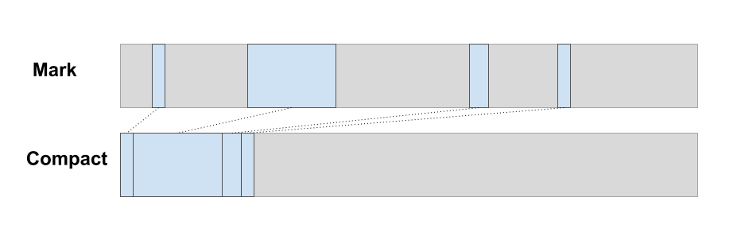

- [Contents](#contents)
- [Demos](#demos)
- [Effects](#effects)
- [String Encoding](#string-encoding)
- [Garbage Collector](#garbage-collector)
- [Closures](#closures)
- [Extensible Records](#extensible-records)
- [Value Headers](#value-headers)
- [Type tags & constrained type variables](#type-tags--constrained-type-variables)
- [Boxed vs unboxed integers](#boxed-vs-unboxed-integers)


## Why use an intermediate language?

It would certainly be possible to compile Elm code directly to WebAssembly. In fact that's what I did in [my first attempt](https://github.com/brian-carroll/elm-compiler/tree/wasm). There are a few drawbacks to this:

1. Writing Kernel code in WebAssembly is **not fun**.
   - Initially I thought I could build up a little Haskell DSL to abstract over raw WebAssembly, since I already had that kind of machinery in my fork of the compiler. But I gave up after just trying to implement one kernel function. I found it completely impractical to debug. I'm no fan of C but it's far more readable than WebAssembly!
2. Debugging the output of the compiler is also **not fun**
   - Like any other coding project, you're going to spend a lot of time getting stuff wrong and debugging it. I really really didn't fancy doing that in raw WebAssembly
3. Compilers for C (and C++ and Rust) are *very good* at producing high-quality optimised assembly code. They've been optimising it for decades. I probably can't beat that performance sitting on my couch in my pyjamas. Might as well use what's out there.


## Why  C and not Rust?

Rust has great WebAssembly support and I tried to use it initially but

- By the time the Elm compiler actually gets to the code generation phase, the program has already been validated by Elm's type checker. So I <u>know</u> it's OK but now I have to convince Rust that it's OK, and I found this was very difficult.
- Rust is very good for *hand-written* code that does *manual memory management*, but not so much for auto-generated code running with a garbage collector. I found it was throwing errors about a lot of things that were actually _good_ ideas in that context.
- A language implementation, particularly one with a GC, is going to involve a lot of `unsafe` Rust. That's quite advanced Rust programming. It would have been too hard for me to know when to go against the normal rules and when not to, on my very first Rust project.

# Contents

- [Project goals](#project-goals)
- [Demos](#demos)
- [Progress](#progress)
- [Big picture stuff](#big-picture-stuff)
- [Effects](#effects)
- [Elm &rarr; JS + Wasm](#elm--js--wasm)
- [String Encoding](#string-encoding)
- [Garbage Collector](#garbage-collector)
- [Closures](#closures)
- [Extensible Records](#extensible-records)
- [Value Headers](#value-headers)
- [Type tags & constrained type variables](#type-tags--constrained-type-variables)
- [Boxed vs unboxed integers](#boxed-vs-unboxed-integers)
- [Alternatives to C](#alternatives-to-c)

# Demos

I have built a few demos here: https://brian-carroll.github.io/elm_c_wasm/

At this early stage, they're very primitive demos! Definitely not full Elm programs in Wasm!

- Unit tests for the kernel code are [here](https://brian-carroll.github.io/elm_c_wasm/unit-tests/index.html?argv=--types+--utils+--basics+--string+--verbose)
  - You can see byte-level Elm data structures, arithmetic operations, record updates and accessors, and first-class functions in action.
- Unit tests for the garbage collector are [here](https://brian-carroll.github.io/elm_c_wasm/unit-tests/index.html?argv=--gc+--verbose)
  - You can see print-outs of the heap, with byte-level Elm data structures, GC mark bits, etc.
- Some performance micro-benchmarks are [here](https://brian-carroll.github.io/elm_c_wasm/benchmark/index.html)
  - Reported figures for the Wasm implementations are slower than the JS implementations.
    - This is partly to do with crossing back and forth across the JS/Wasm boundary _a lot_. The benchmarking loop is in JS even when functions under test are in Wasm. Browsers can't optimise this as well as pure JS yet, and it's exaggerated by testing tiny functions.
    - It's also partly to do with the way Elm implements currying using the `A2` helper. This is something that could be changed in future.
  - Nevertheless, this is a good way to stress-test the implementation and flush out bugs in the GC, and to find out where the bottlenecks are (such as those described above).

&nbsp;

&nbsp;

# Effects

Currently Wasm does not have direct support for any Web APIs such as DOM, XmlHttpRequest, etc. You have to call out from WebAssembly to JavaScript to use them. That means that effectful modules like `VirtualDom`, `Browser`, and `Http`, cannot be fully ported to WebAssembly yet. A few effects could be ported, but not enough to justify the effort of porting lots of complex kernel code to C (like [Scheduler.js](https://github.com/elm/core/blob/1.0.2/src/Elm/Kernel/Scheduler.js) and [Platform.js](https://github.com/elm/core/blob/1.0.2/src/Elm/Kernel/Platform.js)), so I think it's better to leave that for later.

In the meantime, I think a good goal is to compile the pure part of the Elm program to WebAssembly and leave the effectful Kernel code in JavaScript. The way I envision it working is that there would be a "wrapper" `Program` type that acts as an interface between the Elm runtime and the WebAssembly module.

There are two ways for JavaScript and WebAssembly to talk to each other

- **Function calls**: The WebAssembly module can *import* JavaScript functions and call them, and *export* some of its own functions to make them callable from JavaScript. The main limitation is that the arguments can only be numbers, not data structures.
- **Data**: For data structures, you need to read and write to the WebAssembly module's memory, which appears in JavaScript as an `ArrayBuffer`. JavaScript can write bytes into the memory and then call an exported function when the data is ready (perhaps passing the offset and size of the data written). More details [here](https://developer.mozilla.org/en-US/docs/WebAssembly/Using_the_JavaScript_API#Memory).

The wrapper `Program` would convert the `msg` and `model` to a byte-level representation, write them to the WebAssembly module's memory, and then call an `update` function exposed by the compiled WebAssembly module. 

The `update` will return a new `model` and `Cmd`, which will be decoded from bytes to the JavaScript structures that the Elm runtime kernel code uses.

`VirtualDom` effects could be trickier. It might be worth implementing the diff algorithm in pure Elm and using ports to apply the patches, as *gampleman* demonstrated [here](https://gist.github.com/gampleman/cbf0434b22e1da0e3193736b87e040f5) in the Elm 0.18 days.

&nbsp;

# String Encoding

WebAssembly has no string primitives, so they have to be implemented at the byte level. Different source languages targeting WebAssembly may have different string representations, and WebAssembly needs to support that.

The String struct defined in [types.h](/src/kernel/types.h) contains header and a sequence of bytes. There are various "encodings" of characters to bytes, and the modern _de facto_ standard is UTF-8. A lot of recently-developed languages use it as their default encoding (Go, Rust, etc.).

## String representations in other languages

### Python

The Python 3 Standard library has a Unicode type whose API is Unicode code points. But as per [PEP 393][pep-393], the underlying representation is a C structure that uses different storage formats depending on the maximum character value at creation time. It also holds metadata including length, a hash (for use in dictionary keys etc.), and the representation used.

[pep-393]: https://www.python.org/dev/peps/pep-0393/

### Rust

Rust's [String][rust-string] consists of "a pointer to some bytes, a length, and a capacity. The pointer points to an internal buffer String uses to store its data. The length is the number of bytes currently stored in the buffer, and the capacity is the size of the buffer in bytes." The internal representation is UTF-8. There are APIs to convert between bytes and strings.

[rust-string]: https://doc.rust-lang.org/std/string/struct.String.html#representation

### Java

Similarly, Java's [JEP 254][jep-254] describes multiple string representations depending on the maximum character value. However all the built-in representations use units of either 8 or 16 bits. There is no built-in Unicode support but there are libraries to support it. A detailed density analysis of different string types for Java can be found [here][java-string-density].

[jep-254]: http://openjdk.java.net/jeps/254
[java-string-density]: http://cr.openjdk.java.net/~shade/density/state-of-string-density-v1.txt

### JavaScript

[This article][js-string-encoding] gives a detailed description of JavaScript's string representation. The summary is that the ECMAScript standard allows for engines to use either UTF-16 or UCS-2, which are similar but slightly different. Most engines use UTF-16.

[js-string-encoding]: https://mathiasbynens.be/notes/javascript-encoding

### OCaml

OCaml's [String][ocaml-string] library is based on a sequence of one-byte characters. Unicode support doesn't seem to be strong.

[ocaml-string]: https://caml.inria.fr/pub/docs/manual-ocaml/libref/String.html

### Summary

Most languages seem to grapple with a tradeoff between Unicode compliance, convenience, and memory density. It's considered best practice to present the application programmer with an API that treats strings as sequences of Unicode characters, while trying to have an underlying representation that is as dense as possible.

Most guides on this are targeted at application developers rather than language implementers. Best practice guides such as [The Unicode Book][unicode-book] and one from the [Flask][flask] web framework, advocate that programs should deal exclusively with Unicode characters internally, and only do encoding and decoding when dealing with external systems you can't control. In Elm this means the `String` package should provide functions to iterate over Unicode `Char`s and only Effect Managers should deal with encodings.

The internal memory representation should be something that facilitates this.

[flask]: http://flask.pocoo.org/docs/1.0/unicode/
[unicode-book]: https://unicodebook.readthedocs.io/good_practices.html

## Strings with Web APIs

Most of the browser's Web APIs use JavaScript Strings in UTF-16 format. For example `document.getElementById` expects its argument to be a [DOMString][domstring], which is UTF-16. `XmlHttpRequest` can deal with UTF-8 request and response bodies, but what about the string that specifies the URL? That's usually done with JavaScript strings. When the WebAssembly API comes out, will that require UTF-16 too? I can only suppose that the browser's underlying C++ implementation expects UTF-16, so wouldn't it present this to WebAssembly?

[domstring]: https://developer.mozilla.org/en-US/docs/Web/API/DOMString

There's limited information at this stage on how the Web APIs will work with WebAssembly. There's an [overview of the proposal][host-bindings] but it seems to leave a lot up to browser vendors. It focuses on very low-level details and doesn't say anything about specific APIs like DOM or HTTP.

[host-bindings]: https://github.com/WebAssembly/host-bindings/blob/master/proposals/host-bindings/Overview.md

The general idea is that each Web API will be represented as a "table" of numbered functions. To send a string from Wasm to a browser API, the Wasm program writes it to its own block of memory and passes the address and length to one of the API functions. The Wasm memory block is visible to JavaScript as an ArrayBuffer and also visible to browser APIs, so it can be read from there.

When the browser sends a string to Wasm, calls an "exported" function in the Wasm program to tell it how much memory to allocate for that string. The Wasm program returns a memory address for the external code to write to, and gets a callback when it is done.

The proposal does actually mention UTF-8 encoded strings as one of the possible interface types. It also mentions ArrayBuffer and JSON. The JSON data is "parsed as if it were passed to `JSON.parse()`", which sort of implies UTF-16, I think. It remains to be seen how many Web APIs will actually provide the UTF-8 String argument type.

## Conclusions on string encoding

If Elm was targeting native compilation then UTF-8 would definitely be the way to go. But it's quite focused on the browser as a platform, so it seems like there may be real performance reasons to use UTF-16. It's probably worth doing some benchmarking once the Web APIs become available in Wasm.

UTF-16 has a bit of a bad reputation because of buggy implementations that have been done in the past. There are a lot of UTF-16 string APIs that confuse characters with code units, including JavaScript's (and in some cases, even Elm's!). But as far as I know it's perfectly possible to do a _good_ implementation.

```elm
> s = "🙈🙉🙊"
"🙈🙉🙊" : String
> String.length s
6 : Int
> List.length (String.toList s)
3 : Int
```

&nbsp;

# Garbage Collector

I've built a prototype Garbage Collector in this repo (see [gc.c](/src/kernel/gc.c)). I don't have any Elm programs compiled to Wasm yet, but I do have [unit tests][unit-tests-gc] and a [benchmark demo](https://brian-carroll.github.io/elm_c_wasm/benchmark/index.html).

[unit-tests-gc]: https://brian-carroll.github.io/elm_c_wasm/unit-tests/index.html?argv=--gc+--verbose

_The GC fits into less than 7kB of binary Wasm!_


## Taking advantage of immutability

It seems intuitive that *something* about immutability should simplify the GC. But what exactly? I had an "aha" moment about this when I read [this article about the Haskell GC](https://wiki.haskell.org/GHC/Memory_Management).

> The trick is that immutable data NEVER points to younger values... At any time we can scan the last values created and free those that are not pointed to from the same set

This means it's very efficient to do a "minor GC" of the most recently-created values. You don't need to scan the entire heap to see if any older value is pointing to the new values, because that's impossible.

The funny thing is, when you read the full Haskell paper linked in the article, it turns out Haskell *does* have some mutation! It has a feature called `MVar`, and the GC has to have special cases for it, including "write barriers" that track old-to-young pointers. The [OCaml GC](https://v1.realworldocaml.org/v1/en/html/understanding-the-garbage-collector.html#the-mutable-write-barrier) and the [Chrome V8 GC](https://v8.dev/blog/trash-talk#minor-gc) also have write barriers. But a GC for Elm doesn't need this at all.


## GC architecture choice

I've done some research on the different memory management architectures. Here are my thoughts about how they relate to Elm.

Firstly, let's look a few relevant languages and runtimes and see what choices they've made.

| Garbage collector                                            | Architecture                                                 |
| ------------------------------------------------------------ | ------------------------------------------------------------ |
| [Haskell](http://simonmar.github.io/bib/papers/parallel-gc.pdf) | Multi-generational copying                                   |
| [OCaml](https://v1.realworldocaml.org/v1/en/html/understanding-the-garbage-collector.html) | Semi-space copying for young generation, mark-sweep for old generation |
| [Chrome/V8](https://v8.dev/blog/trash-talk)                  | Semi-space copying for young generation, mark-compact for old generation |
| [Firefox/SpiderMonkey](https://developer.mozilla.org/en-US/docs/Mozilla/Projects/SpiderMonkey/Internals/Garbage_collection) | Mark-sweep with generational collection and compaction       |
| [Safari/WebKit](https://webkit.org/blog/7122/introducing-riptide-webkits-retreating-wavefront-concurrent-garbage-collector/) | Mark-sweep with generational collection                      |

### Reference counting

This suggestion comes up a lot in the Elm Discourse when GC is mentioned, because it's simple to implement. For example it does not move values around in the heap, so it doesn't have to worry about pointers in the stack becoming stale, which avoids lots of complexity. It's used in Swift, Perl and Python, but not in any ML-family languages or browser engines.

The major drawback is that it performs some work for every *dead* value as well as every *live* value. In a language with immutable data, you have to create new values whenever you want to change something. This means there is much, much more garbage created compared to other language types. The number of live values tends to be very small when you do a GC. Therefore <u>Elm is basically a worst-case scenario for reference counting</u>. The other schemes only perform work for live values so they're more efficient in this use case.

I didn't implement reference counting because of this performance concern, and because it doesn't seem to be used in any comparable runtimes. I felt I could create a tracing GC that was small enough. I ended up with <7kB so I'm happy with the decision.

### Copying collector

A copying collector maintains a *from-space* and *to-space*, copying live values from one to the other, then switching around *from-space* and *to-space*. The technique is sometimes known as "semi-space copying". It only performs work for live values, so is efficient for the youngest generation.

Haskell extends this to many spaces instead of just two, which makes it more efficient. OCaml and V8 use it only for "young generation" values.

This architecture should perform well for Elm, but I decided not to use it. If you use only two heap regions, the GC is not too complex but it doubles the heap size. If you use lots of regions, like Haskell does, it's more efficient in size, but you have to manage lots of regions. This seems to involve quite a bit of complexity overhead.

I also didn't want to follow OCaml and V8 down the route of using a copying collector _and_ a mark-sweep.

### Mark-sweep

This is the most commonly-used architecture in the table above. In the *mark* phase, live values are marked and unmarked values are considered dead. In the *sweep* phase, all the dead space is added to the _free list_, so that it can be re-allocated later.

The *sweep* phase performs work for dead values as well as live ones. That's why OCaml and V8 avoid it for the youngest generation that contains the most garbage. Here they use semi-space copying instead. But  again, for Elm in WebAssembly this kind of hybrid approach seems a bit complex.

### Mark-compact

Spoiler alert: **this is the one I implemented!**

In the *mark* phase, live values are marked and unmarked values are considered dead. In the *compact* phase, dead spaces are filled by moving live values into them.



There is no need for a *sweep* phase because there is no "free list". All the free space is at the top of the heap! Nice and simple.

Also note that the compaction only performs work for live values, not dead ones.

With mark-compact, the heap naturally organises itself into generations. The oldest values end up at the bottom of the heap and the newest at the top. So we get a generational memory layout without the overhead of managing multiple regions of memory!


## Minor GC

Since Elm values are immutable, all pointers must point from younger to older values (at lower addresses).

We can run a Minor GC on the young generation only, ignoring the older generation. It's very east to test whether a value is in the older generation. Just check if its address is below a threshold!


While tracing a value during minor GC, we can stop as soon as we see any address in the old generation. Everything in the old generation is considered "marked" for minor GC, and it can only point to other old generation values. So there is no need to trace any further. We already know the outcome. This should speed things up considerably.

Compacting should also be fast simply because it only operates on live values, which are few and far between in the young generation.


## Mutable values in kernel code

The GC design relies on all values being immutable, but when we implement effect managers in WebAssembly, some of them will need to mutate heap-allocated values! Remember, Elm has _controlled effects_, but it does have effects! Does this mess everything up our lovely immutable GC?

Nope!

The solution here is to write the effect manager code so that it only mutates a _pointer_ to an immutable heap value instead of the value itself. The pointer does not have to be in the heap, and so is not subject to the immutability rules. And it's a fixed size.

This is pretty similar to how the Elm runtime already handles `model` updates. Instead of mutating the model directly, you create a new one and then switch a reference that points at it.

This would require changes in the way some of the core modules work, mainly [Scheduler.js](https://github.com/elm/core/blob/1.0.2/src/Elm/Kernel/Scheduler.js) and [Platform.js](https://github.com/elm/core/blob/1.0.2/src/Elm/Kernel/Platform.js).


## Updating pointers in the call stack

The GC also takes advantage of the fact that Elm functions are pure.

When resuming execution after a GC pause, the GC restores the state of the call stack to what it was before the pause.

Most GC's scan the stack and registers for stale pointers to heap values that have moved, and mutate them in place. It's tricky business at the best of times, but as far as I can tell, WebAssembly's semantics actually make it impossible! This is part of its security-focused design.

To solve this, I developed something I call "replay mode". When resuming execution, we can actually skip any function that had already returned a value before the GC pause. Instead of actually executing the call again, we just re-use the return value from last time. It's still in the heap.

Part of the machinery for this is in the C function `Utils_apply`, which implements Elm function application (including partial application etc.) Before executing a function, it does a fast check to see if GC replay mode is active, and executes a different code branch if so.

With this system, the call stack quickly gets to its original state, plus we skip the vast majority of code execution and do no new allocations. The old call stack with its stale pointers has been discarded. The brand new call stack is guaranteed only to be referencing new, valid memory locations.

In order to implement "replay mode", the GC inserts special markers into the heap to keep track of which call allocated each value, and which are currently active. It's an implementation of a "stack map".

For more detail, you can check out the output of the `gc_replay_test` [in your browser][unit-tests-gc], or take a look at the [test code](/src/test/gc_test.c) or the comments in the [source code](/src/kernel/gc.c).


## Scheduling collections

Hopefully we can schedule most collections during the idle time just after an `update`. If that works well, we won't need to have any GC pauses at all. The "replay mode" described above is only needed if we run out of memory during an `update`.

&nbsp;

# Closures

I previously wrote a [blog post][blogpost] about how to implement Elm first-class functions in WebAssembly. The Closure data structure in [types.h](/src/kernel/types.h) is based on those ideas, although it has evolved slightly in the meantime.

In a nutshell, the Closure data structure is a value that can be passed around an Elm program. It stores up any arguments that are partially applied to it, until it is "full". It also contains a function pointer, so that when the last argument is applied, the actual "evaluator" function can be called.

A working example of all of this can be the tests for the `apply` operator. Check out the [source][utils-test-src] or [run the tests][utils-test-run] in your browser.

[utils-test-src]: /src/test/utils_test.c
[utils-test-run]: https://brian-carroll.github.io/elm_c_wasm/unit-tests/index.html?argv=--utils+--verbose
[blogpost]: https://dev.to/briancarroll/elm-functions-in-webassembly-50ak

&nbsp;

# Extensible Records

A good intro to Elm extensible records can be found [here](https://elm-lang.org/docs/records#access). In this project they are split into two C structs, `Record` and `FieldSet`, defined in [types.h](./src/kernel/types.h).

Field names are represented as integer "field IDs". The compiler would convert every field name in the program to a unique ID, using the same kind of [optimisation][shortnames] the Elm 0.19 compiler uses to shorten fieldnames in `--optimize` mode.

[shortnames]: https://github.com/elm/compiler/blob/0.19.0/compiler/src/Generate/JavaScript/Mode.hs#L79

The `Record` struct stores only the values, in ascending order of the corresponding field IDs. The field IDs themselves are stored in a `FieldSet`, a single structure shared by all values of the same Record type, in ascending order. To access a field by its field ID, we first look up the field ID in the `FieldSet`. If it's in the nth position, then the corresponding value will also be in the nth position in the Record itself.

## Record accessor functions

Elm has special functions for accessing records, prefixed by a dot, like `.name`, which can be applied to _any_ Record type that contains a field called `name`. It's implemented using a Kernel function that takes the field ID as an Elm `Int`, and the record itself.

```elm
    access : Int -> r -> a
    access fieldId record =
        -- Kernel C code
        -- 1. Look up the FieldSet that this record points to
        -- 2. Find the index of `fieldId` in that FieldSet (binary search)
        -- 3. Return the value found at the value at that same index in `record`
```

The compiler would insert code to create each accessor function by partially applying the relevant `fieldId` to `access` function in the generated code.

```elm
    -- Compiler inserts something roughly equivalent to this to to define `.name`
    .name record = access 123 record  -- where 123 is the field ID for 'name'
```

The implementation is in [utils.c](/src/kernel/utils.c) (see `access_eval`). The code is unsafe if the field does not actually exist in the record, but it can only be called in compiler-generated code.

## Record update

Elm's record update syntax is `r2 = { r1 | field1 = newVal1, field2 = newVal2 }`

Currently, Elm implements this using a [JavaScript function][js-update]. We do something similar here with a C function called `record_update`, found in [utils.c](./src/kernel/utils.c). A pseudo-code version is below.

[js-update]: https://github.com/elm/core/blob/1.0.2/src/Elm/Kernel/Utils.js#L151

```
Clone the original record
For each field ID to be updated
	Find the index of the field ID in the FieldSet
	Change the pointer in the clone at the same index to point at the updated value
```

Check out the [source][/src/kernel/utils.c] or [run the tests][utils-test-run] in your browser.

&nbsp;

# Value Headers

Every Elm value has a header of 32 bits in size. It's defined in [types.h](./src/kernel/types.h)

```
-----------------------------------------------------
| tag (4 bits) | size (28 bits) |      Elm data     |
-----------------------------------------------------
```

`size` is measured in _words_, where a word is either 32 or 64 bits, depending on the target platform. It makes sense to use words rather than bytes because all values are aligned to word boundaries anyway. For example in a 32-bit system, we'll always place our values at addresses that evenly divide by 4 bytes. Real CPUs are optimised to work faster when pointers are aligned this way.

The only individual value that can get really large in practice is `String`. (Lists don't count, they are made up of many Cons cells.) A maximum value of 2<sup>28</sup>-1 for `size` corresponds to 1 GB on a 32-bit system or 4 GB on a 64-bit system.

We always use 32-bit headers, even on 64-bit systems. 1GB is large enough, there's no point increasing the header size. Wasm is always 32 bits but since we're using C as an intermediate language, we can also create native 64-bit binaries. That's how I run most of my tests.

&nbsp;

# Type tags & constrained type variables

To explain how the type tag in the header works, we need to discuss [constrained type variables][guide-type-vars]. This is the feature of Elm that allows some functions like `++`, `+` and `>`, to work on _more than one, but not all_ types.

[guide-type-vars]: https://guide.elm-lang.org/types/reading_types.html#constrained-type-variables

To facilitate this, we insert a "tag" as metadata into the byte level representation of every Elm value. The tag is a 4-bit number carrying information about the type and memory layout of the value. For example, the low-level implementation for `++` needs to know whether its arguments are Lists or Strings because the memory layout for each is totally different. Using the tag data, it can decide which of two code branches to execute.

| Tag |   Type   | **number** | **comparable** | **appendable** |
| :-: | :------: | :--------: | :------------: | :------------: |
|  0  |  `Int`   |     ✓      |       ✓        |                |
|  1  | `Float`  |     ✓      |       ✓        |                |
|  2  |  `Char`  |            |       ✓        |                |
|  3  | `String` |            |       ✓        |       ✓        |
|  4  |  `List`  |            |       ✓        |       ✓        |
|  5  | `Tuple2` |            |       ✓        |                |
|  6  | `Tuple3` |            |       ✓        |                |
|  7  |  Custom  |            |                |                |
|  8  |  Record  |            |                |                |
|  9  | Closure  |            |                |                |

_The remaining 6 possible values (`a`&rarr;`f`) are reserved for Garbage Collector record-keeping data.)_

For more details see the [header file](/src/kernel/types.h) defining the relevant structs, or see the [output of some tests][types-test] in your browser.

[types-test]: https://brian-carroll.github.io/elm_c_wasm/unit-tests/index.html?argv=--types+--verbose

&nbsp;

# Boxed vs unboxed integers

In this project, all values are "boxed" - i.e. they have a header that contains some metadata. They're all stored on the heap, and are referred to via a pointer. This setup makes a lot of sense for more complex value types like lists, tuples, records, strings. But for integers it can be a lot of overhead. The `+` operator has to fetch two structures from memory, separate the integer from its header, add the numbers, wrap the new value in a new data structure, and write it back to memory. For a numerical expression like `a-(b+c)*d`, or more complex expressions, this can be expensive.

Many language implementations "unbox" integers, so they're represented directly as machine integers without any wrapper or metadata. This can be a big performance gain for some common code patterns, but it requires a lot of book-keeping. It can be hard to tell the difference between integers and pointers, you need some system to keep track of what's what.

In this project I've avoided unboxing integers because it seems like it would be a major piece of work. I'd rather try to build a working implementation first, and optimise later.

However there are some relatively simple compiler optimisations that could reduce the cost of boxing. For a start, we could translate an Elm expression like `a-(b+c)*d` into the equivalent expression in C, only boxing the final result rather than the result of each subexpression. This kind of thing should be limited to just the code generator. In fact the Elm compiler's JS code generator already has some [special handling for numerical operators](https://github.com/elm/compiler/blob/0.19.0/compiler/src/Generate/JavaScript/Expression.hs#L526).

&nbsp;


