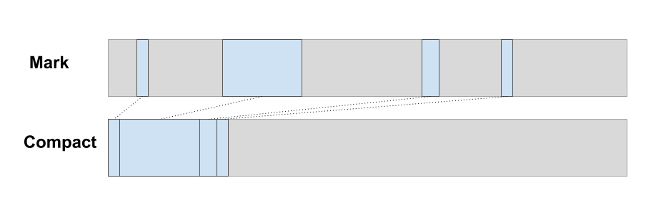
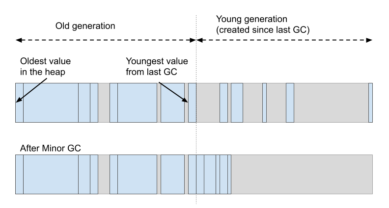

# Garbage Collector

I've built a prototype Garbage Collector in this repo (see [gc.c](/src/kernel/gc.c)). I don't have any Elm programs compiled to Wasm yet, but I do have [unit tests][unit-tests-gc] and a [benchmark demo](https://brian-carroll.github.io/elm_c_wasm/benchmark/index.html).

[unit-tests-gc]: https://brian-carroll.github.io/elm_c_wasm/unit-tests/index.html?argv=--gc+--verbose

_The GC fits into less than 7kB of binary Wasm!_

&nbsp;

## Taking advantage of immutability

It seems intuitive that _something_ about immutability should simplify the GC. But what exactly? I had an "aha" moment about this when I read [this article about the Haskell GC](https://wiki.haskell.org/GHC/Memory_Management).

> The trick is that immutable data NEVER points to younger values... At any time we can scan the last values created and free those that are not pointed to from the same set

This means it's very efficient to do a "minor GC" of the most recently-created values. You don't need to scan the entire heap to see if any older value is pointing to the new values, because that's impossible.

The funny thing is, when you read the full Haskell paper linked in the article, it turns out Haskell _does_ have some mutation! It has a feature called `MVar`, and the GC has to have special cases for it, including "write barriers" that track old-to-young pointers. The [OCaml GC](https://v1.realworldocaml.org/v1/en/html/understanding-the-garbage-collector.html#the-mutable-write-barrier) and the [Chrome V8 GC](https://v8.dev/blog/trash-talk#minor-gc) also have write barriers. But a GC for Elm doesn't need this at all.

&nbsp;

## GC architecture choice

I've done some research on the different memory management architectures. Here are my thoughts about how they relate to Elm.

Firstly, let's look a few relevant languages and runtimes and see what choices they've made.

| Garbage collector                                                                                                            | Architecture                                                             |
| ---------------------------------------------------------------------------------------------------------------------------- | ------------------------------------------------------------------------ |
| [Haskell](http://simonmar.github.io/bib/papers/parallel-gc.pdf)                                                              | Multi-generational copying                                               |
| [OCaml](https://v1.realworldocaml.org/v1/en/html/understanding-the-garbage-collector.html)                                   | Semi-space copying for young generation, mark-sweep for old generation   |
| [Chrome/V8](https://v8.dev/blog/trash-talk)                                                                                  | Semi-space copying for young generation, mark-compact for old generation |
| [Firefox/SpiderMonkey](https://developer.mozilla.org/en-US/docs/Mozilla/Projects/SpiderMonkey/Internals/Garbage_collection)  | Mark-sweep with generational collection and compaction                   |
| [Safari/WebKit](https://webkit.org/blog/7122/introducing-riptide-webkits-retreating-wavefront-concurrent-garbage-collector/) | Mark-sweep with generational collection                                  |

### Reference counting

This suggestion comes up a lot in the Elm Discourse when GC is mentioned, because it's simple to implement. For example it does not move values around in the heap, so it doesn't have to worry about pointers in the stack becoming stale, which avoids lots of complexity. It's used in Swift, Perl and Python, but not in any ML-family languages or browser engines.

The major drawback is that it performs some work for every _dead_ value as well as every _live_ value. In a language with immutable data, you have to create new values whenever you want to change something. This means there is much, much more garbage created compared to other language types. The number of live values tends to be very small when you do a GC. Therefore <u>Elm is basically a worst-case scenario for reference counting</u>. The other schemes only perform work for live values so they're more efficient in this use case.

I didn't implement reference counting because of this performance concern, and because it doesn't seem to be used in any comparable runtimes. I felt I could create a tracing GC that was small enough. I ended up with <7kB so I'm happy with the decision.

### Copying collector

A copying collector maintains a _from-space_ and _to-space_, copying live values from one to the other, then switching around _from-space_ and _to-space_. The technique is sometimes known as "semi-space copying". It only performs work for live values, so is efficient for the youngest generation.

Haskell extends this to many spaces instead of just two, which makes it more efficient. OCaml and V8 use it only for "young generation" values.

This architecture should perform well for Elm, but I decided not to use it. If you use only two heap regions, the GC is not too complex but it doubles the heap size. If you use lots of regions, like Haskell does, it's more efficient in size, but you have to manage lots of regions. This seems to involve quite a bit of complexity overhead.

I also didn't want to follow OCaml and V8 down the route of using a copying collector _and_ a mark-sweep.

### Mark-sweep

This is the most commonly-used architecture in the table above. In the _mark_ phase, live values are marked and unmarked values are considered dead. In the _sweep_ phase, all the dead space is added to the _free list_, so that it can be re-allocated later.

The _sweep_ phase performs work for dead values as well as live ones. That's why OCaml and V8 avoid it for the youngest generation that contains the most garbage. Here they use semi-space copying instead. But again, for Elm in WebAssembly this kind of hybrid approach seems a bit complex.

### Mark-compact

Spoiler alert: **this is the one I implemented!**

In the _mark_ phase, live values are marked and unmarked values are considered dead. In the _compact_ phase, dead spaces are filled by moving live values into them.

There is no need for a _sweep_ phase because there is no "free list". All the free space is at the top of the heap! Nice and simple. And the compaction only performs work for live values, not dead ones, which is what we want.

With mark-compact, the heap naturally organises itself into generations. The oldest values end up at the bottom of the heap and the newest at the top. So we get a generational memory layout without the overhead of managing multiple regions of memory!

&nbsp;

## Minor GC with mark-compact

Since Elm values are immutable, all pointers must point from younger to older values (at lower addresses).

We can run a Minor GC on the young generation only, ignoring the older generation. It's very east to test whether a value is in the older generation. Just check if its address is below a threshold!

While tracing a value during minor GC, we can stop as soon as we see any address in the old generation. Everything in the old generation is considered "marked" for minor GC, and it can only point to other old generation values. So there is no need to trace any further. We already know the outcome. This should speed things up considerably.

Compacting should also be fast simply because it only operates on live values, which are few and far between in the young generation.

The lower threshold address for the collection does not _have_ to be where I've drawn it here. On any cycle, we can choose any threshold address and limit the collection to addresses above it. We could decide to have many generations, rather than just two. Or we could choose the threshold based on some algorithm that accounts for the fact that space at the bottom of the heap is more expensive to free up.

&nbsp;

## Mutable values in kernel code

The GC design relies on all values being immutable, but when we implement effect managers in WebAssembly, some of them will need to mutate heap-allocated values! Remember, Elm has _controlled effects_, but it does have effects! Does this mess everything up our lovely immutable GC?

Nope!

The solution here is to write the effect manager code so that it only mutates a _pointer_ to an immutable heap value instead of the value itself. The pointer does not have to be in the heap, and so is not subject to the immutability rules. And it's a fixed size.

This is pretty similar to how the Elm runtime already handles `model` updates. Instead of mutating the model directly, you create a new one and then switch a reference that points at it.

This would require changes in the way some of the core modules work, mainly [Scheduler.js](https://github.com/elm/core/blob/1.0.2/src/Elm/Kernel/Scheduler.js) and [Platform.js](https://github.com/elm/core/blob/1.0.2/src/Elm/Kernel/Platform.js).

&nbsp;

## Updating pointers in the call stack

The GC also takes advantage of the fact that Elm functions are pure.

When resuming execution after a GC pause, the GC restores the state of the call stack to what it was before the pause.

Most GC's scan the stack and registers for stale pointers to heap values that have moved, and mutate them in place. It's tricky business at the best of times, but as far as I can tell, WebAssembly's semantics actually make it impossible! This is part of its security-focused design.

To solve this, I developed something I call "replay mode". When resuming execution, we can actually skip any function that had already returned a value before the GC pause. Instead of actually executing the call again, we just re-use the return value from last time. It's still in the heap.

Part of the machinery for this is in the C function `Utils_apply`, which implements Elm function application (including partial application etc.) Before executing a function, it does a fast check to see if GC replay mode is active, and executes a different code branch if so.

With this system, the call stack quickly gets back to the same state it was in before the GC pause. At this point we exit replay mode and resume normal execution from where we left off. The old call stack with its stale pointers has been discarded, and the brand new call stack is guaranteed only to be referencing new, valid memory locations.

In order to implement "replay mode", the GC inserts special markers into the heap to keep track of which call allocated each value, and which are currently active. It's an implementation of a "stack map".

For more detail, you can check out the output of the `gc_replay_test` [in your browser][unit-tests-gc], or take a look at the [test code](/src/test/gc_test.c) or the comments in the [source code](/src/kernel/gc.c).

&nbsp;

## Scheduling collections

Hopefully we can schedule most collections during the idle time just after an `update`. If that works well, we won't need to have any GC pauses at all. The "replay mode" described above is only needed if we run out of memory during an `update`.
