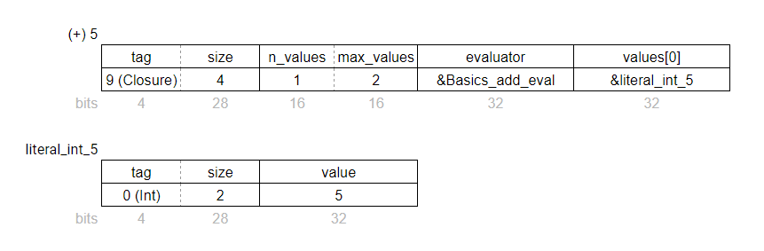

# The WebAssembly/JavaScript interface

The aim of this project is to gradually implement the Elm language in WebAssembly. But currently Wasm is still in MVP stage and does not have direct access to browser APIs like the DOM, `XmlHttpRequest`, `Date`, and so on. (A few WebAssembly proposals need to get implemented first, such as [GC](https://github.com/WebAssembly/gc/blob/master/proposals/gc/Overview.md#host-types) and [type imports](https://github.com/WebAssembly/proposal-type-imports/blob/master/proposals/type-imports/Overview.md).)

This means that for now, some of Elm's Kernel code needs to remain in JavaScript. The rest can be implemented in WebAssembly, but that means we have two different compile targets that need to work together!

Later we'll do a detailed analysis of what needs to stay in JavaScript and what can go in WebAssembly, but let's get a quick overview first.

Essentially we have the Elm app in WebAssembly and the effectful "Elm runtime" in JavaScript. The only Kernel code on the WebAssembly side is what's required to implement the Elm data types: integers, floats, characters, strings, lists, tuples, records, custom types, and functions.


## Analysis of the JS/Wasm split

This section provides some further analysis of the JS/Wasm split shown in the above diagram. Feel free to skip ahead to the [next section](#wrapper) if that already makes sense to you!

### Elm application code

Well, this is the easy one. It's all in Elm. It can't directly call Web APIs, because those are _effects_ and only the Elm runtime can do effects. So it's fine to implement all of the app code in WebAssembly. And otherwise there wouldn't be much to do in this project!

<u>Conclusion</u>: This code belongs in **WebAssembly**.

### Elm code in the standard libraries

Lots of the code in `elm/core` and other standard libraries is written in pure Elm. This includes modules such as `Tuple`, `Maybe`, `Result`, `Dict`, `Set`, and `Array`. These can just be compiled like any other Elm file, along with user application code. So they'll end up in WebAssembly too.

<u>Conclusion</u>: This code belongs in **WebAssembly**.

### Kernel code that calls Web APIs

This is the stuff that definitely has to be in JavaScript for now due to limitations of the WebAssembly MVP. It includes kernel code from `elm/virtual-dom` and almost any package that can give you a `Cmd` or `Task` value, like `elm/http`, `elm/time`, and so on.

> In some cases there is a possiblity of moving _parts_ of kernel files into WebAssembly. VirtualDom creation and diffing, for example. Only the "patching" part of VirtualDom _needs_ to be in JS. So this categorisation doesn't necessarily follow the same boundaries as the existing files. But for the most part, it does.

<u>Conclusion</u>: This code belongs in **JavaScript**.

### Kernel code for the effects runtime

This category is often what people mean when they talk about "the Elm runtime". It's the part of `elm/core` that manages and schedules the effects that you request from your program. It's responsible for making calls to your `init`, `update`, `subscriptions`, and `view`. When those functions return a `Cmd`, `Sub`, or VirtualDom tree, this is the code that schedules and dispatches the effects, and calls you back with any resulting messages.

The main files involved are `Scheduler.js`, `Platform.js`, and `Process.js`. They don't use Web APIs themselves, so this code could be implemented in WebAssembly _or_ JavaScript. The choice is not quite as obvious as for the other categories mentioned here!

I've spent quite a bit of time and effort investigating this but I concluded that porting this code to WebAssembly is a huge amount of effort for not much benefit. The effects runtime is intimately connected with the "effect manager" kernel code, most of which _does_ have to be implemented in JS. So if we built WebAssembly implementations of `Scheduler.js` and friends, they would be doing an _awful lot_ of back-and-forth across the language boundary.

<u>Conclusion</u>: This code belongs in **JavaScript**.

### Kernel code for low-level data structures

There's lots of Kernel JavaScript code in `elm/core` that is not for effects at all, but for low-level data structures and operations. This includes JavaScript files in `elm/core` such as `Basics.js`, `List.js`, `Tuple.js`, `Char.js`, `String.js`, `Bitwise.js`, and `Utils.js`.

Many of the lowest-level operations in Elm need to be written directly in the _target language_ so that everything else can be built on top of them. But here we have _two_ compile targets. Both the WebAssembly side and the JavaScript side need to use basic Elm structures like lists, tuples, etc.

<u>Conclusion</u>: This code must be duplicated in **both WebAssembly _and_ JavaScript**!

# Wrapper

The "wrapper" shown in the architecture diagram above is the "glue code" that translates between Wasm data structures and JS data structures, and allows JS and Wasm functions to call each other.

The web platform provides _low level_ tools for JS/Wasm interaction - a Wasm module can "import" functions from JS and "export" functions to JS. But those functions can only operate on integers and floats. There's no built-in support for strings, arrays, objects, etc. So we need to build abstractions on top of this low level API so that we can pass Elm values back and forth, making the JS/Wasm split "invisible" to the Elm program.

The rest of this document details how the wrapper works.

## Wrapper implementation outline

The Elm code representing the wrapper is very simple:

```elm
module WasmWrapper exposing (element)
import Browser
import Html exposing (Html)

element :
  { init : flags -> (model, Cmd msg)
  , view : model -> Html msg
  , update : msg -> model -> ( model, Cmd msg )
  , subscriptions : model -> Sub msg
  }
  -> Program flags model msg
element mainRecord =
    Browser.element mainRecord
```

In the Elm source code, the wrapper just looks like it does nothing. In fact that's the whole point!

However the "compiler" <sup>(see notes)</sup> knows about this module and treats it specially. The actual implementation of `WasmWrapper.element` reads `mainRecord` from the WebAssembly module, converts it to the equivalent JavaScript object, and passes that on to `Browser.element`, an effectful Kernel function implemented in JavaScript.

Here's what happens in a bit more detail:

- When the program is initialised, it calls an exported getter function on the Wasm module called `getMainRecord()`, that returns the address of the `mainRecord` in the Wasm module's memory.
- The JS wrapper reads the data at the corresponding index in the `ArrayBuffer` corresponding to the Wasm module's memory. From the header bytes, it knows it's a Record with 4 key/value pairs. From the body, it is able to find the names of the 4 keys and the addresses of each of the 4 values.
- On reading each of the 4 values in the record, the wrapper recognises the `Closure` data structure and creates a JavaScript callback function from it. This takes a bit of explaining so let's look at it in the next section.

> **Notes**
>
> I mention "compiler" above, but for now it's just a [Bash script](../demos/wrapper/build-combine.sh) that modifies the official compiler's JS output, merging some other JS files into it.
>
> I thought about using `elm/bytes` but it's not really suited to this situation. For one thing, we need to send _functions_ back and forth as well as data. Also there are some low-level interactions with the Wasm module itself that need to be written in JS.
>
> I actually use TypeScript as a source language, just to help make sure the JavaScript is correct. But if required, the TypeScript code could easily be abandoned and replaced with the JavaScript version. I've made sure it's readable.

## Elm functions in WebAssembly

To understand how we pass functions across the JS/Wasm boundary, we need to take a look at how Elm functions are implemented on the Wasm side.

The C language doesn't allow you to pass functions around as values, nor to "partially apply" them. But it does allow _function pointers_ to be passed around as values. We represent an Elm function as a data structure called `Closure` that contains a pointer to a C function and pointers to any partially-applied arguments. This structure is used by the "function application" operator, which implements features like partial application, higher-order functions, and so on.

Let's look at the Wasm representation of the partially applied Elm function `(+) 5 : Int -> Int`. This function adds 5 to any integer, and its representation is shown in the diagram below.

The header indicates that it's a `Closure` with a `size` of 4 words (a "word" being 32 bits). It has one applied value (`n_values=1`) and expects 2 values to be applied in total (`max_values=2`). The `evaluator` field points to the C function `Basics_add_eval`, which will be called when the last argument is applied. The `values[0]` field points to the partially applied argument `literal_int_5`.



<u>Note</u>: Elm `Int` is implemented as a data structure with a header, because it helps with "constrained type variables" like `number` and `comparable`. There are more efficient ways integers could be represented in the future.

For further reading you can check out the documentation on [Elm data structures in WebAssembly](./data-structures.md), my [blog post on Closures](https://dev.to/briancarroll/elm-functions-in-webassembly-50ak), the source for the function application operator [`Utils_apply`](../src/kernel/utils.c), and the [C structures for all the Elm types](../src/kernel/types.h).


## Calls from JS runtime to Wasm app

The only calls that are made from the JS runtime to the Wasm app are `init`, `update`, `subscriptions`, `view` and `Msg` constructors. (A `Msg` constructor is a function that wraps the result of a `Cmd` before calling `update`. The simplest case is a single-parameter constructor from a custom `type` definition, but it can be more complex.)

The Wrapper reads these functions from the Wasm memory as `Closure`s, and creates JS function closures from them.

The JS closure remembers the Wasm `evaluator` function pointer and any partially-applied arguments. When called, it encodes any JS arguments to bytes, writes them to the Wasm memory, and creates a new copy of the `Closure`. It then calls the exported Wasm function `evalClosure`, which evaluates the `Closure` and returns the address of the result. The wrapper then reads the value at that address, converts it to a JavaScript representation, and returns it to the Elm runtime.


## Calls from Wasm app to JS runtime

The only calls that are made from the Wasm app to the JS runtime are Kernel calls that return descriptions of effects, such as `Cmd`, `Task`, or `VirtualDom.Node`. We don't have any Wasm representation of these values because we are implementing effects in JS only.

Instead we represent all effect values as "thunks". These are unevaluated `Closure`s that never actually get evaluated in WebAssembly. They are only evaluated by the JavaScript wrapper when it needs to transform it to a JS representation. If you've ever used Haskell, you'll be familiar with the concept of thunks.

When the Elm app (in Wasm) makes a call to a Kernel function like `VirtualDom.text "hello"`, it evaluates to a `Closure` that represents 'whatever value results from calling the JS function `_VirtualDom_text` with argument "hello"'. Since the `VirtualDom.Node` type is opaque in Elm anyway, no Elm function can ever know the difference. These thunks can be nested to any depth. When the `view` function eventually returns to the runtime, the wrapper will want to convert its return value to JS. When it notices that the return value is an unevaluated Kernel call, it will actually *evaluate* the call and get the return value of the JavaScript kernel function.

So in summary, we are doing effects in JS and not Wasm, so we'd prefer not to have to write Wasm representations of effect values. Therefore we _defer_ the actual call to the Kernel function until we're passing through the wrapper. Inside the Wasm Elm app, it just looks like a `Closure`, which is something the Wasm app knows how to handle.

In the implementation, all Kernel `Closure`s are given an "almost infinite" arity (`max_values=0xffff`) to ensure they're always considered to be "partially applied", which means the Wasm code will never evaluate them.

Wasm can only refer to things using numbers, so the wrapper stores a JS array of Kernel functions and Wasm uses its index in that array. The array index is stored in the `evaluator` field of the `Closure`, where we would otherwise store the address of a C function (but JS kernel calls never get evaluated in C).


## Known issues

### Int vs Float ambiguity

If the Elm runtime passes a JavaScript `number` to the app through the WebAssembly wrapper, the wrapper can't accurately detect whether it's supposed to be an `Int` or a `Float` in Elm. JavaScript doesn't make any distinction between the two. Currently I don't have a reliable solution for this!

For the moment, I'm "making do" with an unsafe temporary workaround. The wrapper checks for _whole_ numbers and assumes they should be written to Wasm as `Int`. But this does the wrong thing for `Float` values that happen to be round numbers!

I can see two possible solutions

1. Get type info from the compiler to help with encoding
   - This is difficult! The Elm compiler doesn't provide much type information to the back-end that generates the JavaScript output code. For example if the runtime wanted to send the app a `Msg` containing a number, and we knew the particular `Msg` constructor function accepts `Float`, we can use that info to encode correctly. Unfortunately the code generator doesn't have this information. (It's not crucial for generating JS, the only currently-supported compile target.)
   - It might be possible to trick the compiler into revealing this kind of information by `exposing` the message constructor functions. Then their types might be written to an `.elmi` file. It's not a great solution though.
2. Use some Elm code to help with encoding
   - I haven't thought this through fully. But it should be possible for the app to provide `elm/bytes` encoders for its `Msg` types that would make it easier to know where the `Int` and `Float` values are. Obviously this is a workaround for compiler limitations, but it might unlock progress while those limitations are still there.

### Tuple vs Record ambiguity

In `--optimize` mode, the generated JS for `( 123, "hello" )` is identical to the JS for `{ a = 123, b = "hello" }`

This causes an ambiguity similar to the `Int`/`Float` ambiguity described above. The solutions are similar. We need type info from either the compiler or the app code. In unoptimized mode, Tuple has an extra property that allows us to distinguish it.


## Rejected Idea: "working set" for JS kernel values

Before I thought of treating Kernel calls as thunks, I had another plan. It didn't work, but I thought I'd share in case it saves someone else pain in the future!

Functions like `update` and `view` need some way to work with temporary Kernel values that exist in JS-land but not in Wasm-land. Lower-level `update` functions could create ten `Cmd` values, pass them around the program before finally returning just one from the top-level `update`. In the case of `view`, we need to create a whole _tree_ of JS values tied together using `List`s and `Strings` that _do_ have Wasm representations. And, some parts of the view could be created only to be thrown away later.

The original idea for dealing with this was to immediately call out to JS to get the effect value but put it in a "working set" array in JS. Then I'd send the index of that JS value to Wasm, wrapped in some new C structure that could be called `JsRef` or something. Wasm functions could work with the `JsRef` values and put them into `List`s and so on.

The problem with this idea is memory management. It's very hard to know when it's OK to _delete_ something from this "working set" array of JS objects. We first need to know that no Wasm value is still referring to it. The program could have thrown that `JsRef` into the Model, or into a `Closure` that'll get passed to the runtime and back again later, or anything. It's certainly _possible_ to know that. The Wasm GC has this kind of info. But now we're expanding the scope of the GC beyond the boundaries of Wasm and into JS-land!

Oh dear, this is starting to sound horrible all of a sudden! I do _not_ want to have to debug this thing.

But wait, what if JS values were represented as _thunks_ on the Wasm side?

Now Wasm only needs references to _permanent_ functions on the JS side. There are no dynamically created values, so no memory management issue. We don't actually create any effect values until they're finally returned from `update`, `view` and friends.

Once we've thrown a value over the fence to JS, it gets materialised on the other side as a JS value, so Wasm can forget about it. It's garbage. If JS ever needs to send it back, it will just write a new copy.

Thunks are by far the safer and more maintainable solution.

