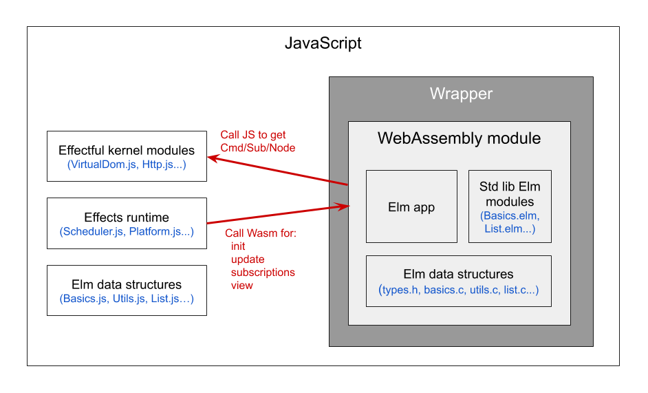

# The WebAssembly/JavaScript interface

The aim of this project is to gradually implement the Elm language in WebAssembly. But currently Wasm is still in MVP stage and does not have direct access to browser APIs like the DOM, `XmlHttpRequest`, `Date`, and so on. (A few WebAssembly proposals need to get implemented first, such as [GC](https://github.com/WebAssembly/gc/blob/master/proposals/gc/Overview.md#host-types) and [type imports](https://github.com/WebAssembly/proposal-type-imports/blob/master/proposals/type-imports/Overview.md).)

This means that for now, some of Elm's Kernel code needs to remain in JavaScript. The rest can be implemented in WebAssembly, but that means we have two different compile targets that need to work together! We need to have a wrapper around the WebAssembly module to transparently connect it to the JS runtime.

Essentially we have the Elm app in WebAssembly and the effectful "Elm runtime" in JavaScript. The only Kernel code that needs to be implemented in WebAssembly is for the core Elm data types: integers, floats, characters, strings, lists, tuples, records, custom types, and functions.



Specifically, the "Effects runtime" is the part of `elm/core` that calls `init`, `update`, `subscriptions`, and `view`. It also manages and schedules the effects that you request by returning `Cmd`, `Sub`, or `VirtualDom.Node` values. The main code files in this section are `Scheduler.js`, `Platform.js`, and `Process.js`. These files don't use Web APIs _directly_, so this code could be implemented in either WebAssembly _or_ JavaScript. But most of the code is interacting with "Effectful kernel modules" that generally _do_ have to be implemented in JS, so it makes sense for the runtime to be in JS as well.

## Working demo

There's a working demo of this setup [here](https://brian-carroll.github.io/elm_c_wasm/wrapper/index.html). It's the simplest app I could think of that shows both `Cmd` and `VirtualDom` effects working! You can also check out the [source code](/demos/wrapper).

## The Wrapper

The "wrapper" shown in the architecture diagram above translates between Wasm and JS data structures, and allows JS and Wasm functions to call each other.

The web platform provides _low level_ tools for JS/Wasm interaction. The Wasm module can "export" functions to JS and "import" functions from JS, but they can only operate on integers and floats. There's no built-in support for strings, arrays, or objects. The wrapper needs to build some abstractions on top of this low level API to deal with Elm data types, making the JS/Wasm boundary "invisible" to the Elm program.

```elm
-- Main.elm
main : Program Flags Model Msg
main =
    WasmWrapper.element -- NOTE: not Browser but WasmWrapper!
        { init = init
        , view = view
        , update = update
        , subscriptions = subscriptions
        }
```

At the level of Elm code, the wrapper has a very simple representation. It just passes values through to `Browser.element`. But the "compiler" knows about this module and treats it specially.

```elm
-- WasmWrapper.elm
module WasmWrapper exposing (element)
import Browser
import Html exposing (Html)

element :
  { init : flags -> (model, Cmd msg)
  , view : model -> Html msg
  , update : msg -> model -> ( model, Cmd msg )
  , subscriptions : model -> Sub msg
  }
  -> Program flags model msg
element mainRecord =
    Browser.element mainRecord
```

Actually in the current prototype, the special behaviour is implemented not by the actual compiler but by a [build script](../demos/wrapper/build-combine.sh) that modifies the standard Elm compiler's JavaScript output code. It modifies the definition of `WasmWrapper.element`, swapping in the "real" implementation that actually interfaces to WebAssembly. At a later stage of the project, this will be incorporated into the compiler itself.

Elm records are implemented as objects in JavaScript, so the implementation of `Browser.element` expects an object containing four functions, corresponding to `mainRecord` in the snippet above. But WebAssembly module makes its equivalent of `mainRecord` available as a chunk of bytes in memory, not as a JS object. So the wrapper reads those bytes and create a JavaScript object containing four functions.

Each of the four JavaScript functions will encode its arguments into bytes, call the corresponding WebAssembly function, and decode the resulting bytes into a JavaScript value.

After modifying the JavaScript output of the Elm compiler, we get something like this:

```js
// ... skipping lots of compiled JavaScript ....

// JavaScript code generated by the standard Elm compiler for WasmWrapper.element
var author$project$WasmWrapper$element = function(mainRecord) {
  return elm$browser$Browser$element(mainRecord);
};

//============ begin build-time inserted code ===================

// ... skipping details ...

// Create a JavaScript wrapper around the WebAssembly module
const wasmMainRecord = wrapWasmElmApp(
  wasmBuffer, // The `ArrayBuffer` memory block shared between JS and Wasm
  wasmExports, // Object of exported functions from the Wasm module
  generatedAppTypes, // App-specific type info (custom type constructor names etc.)
  kernelFunctions // Array of all JS kernel functions called by the Elm Wasm module
);

// _override_ the previous definition of this variable! Evil mutation! OMG!
author$project$WasmWrapper$element = function(jsMainRecord) {
  return _Browser_element(wasmMainRecord); // Ignore jsTeaRecord and use wasmTeaRecord instead!
};

//============ end build-time inserted code ===================

var author$project$Main$main = author$project$WasmWrapper$element({
  init: author$project$Main$init,
  subscriptions: author$project$Main$subscriptions,
  update: author$project$Main$update,
  view: author$project$Main$view
});

// ... more compiled JavaScript ....
```

> **Notes**
>
> - I thought about using `elm/bytes` instead of using JS for encoding and decoding bytes, but it's not ideally suited to this situation. We need to handle _functions_ as well as data. And low-level interactions with the Wasm module itself need to be written in JavaScript.
> - The [source for the wrapper](/src/kernel/wrapper/wrapper.ts) is actually written in TypeScript, because I'm very familiar with it and it helps avoid bugs. But I've made sure not to make TypeScript a hard dependency. The TypeScript code could be abandoned and replaced with the (very readable) JavaScript version.
> - I'm also using modern ES6 because everything that supports WebAssembly supports ES6 too!

## Elm functions in WebAssembly

To understand how we pass functions across the JS/Wasm boundary, we need to take a close look at how Elm functions are implemented on the Wasm side.

The C language doesn't allow you to pass functions around as values, nor to "partially apply" them. But it does allow _function pointers_ to be passed around as values. So we can represent an Elm function as a data structure called `Closure`, containing a pointer to a C function and some pointers to any partially-applied arguments. This structure is used by the "function application" operator to implement features like partial application, higher-order functions, and so on.

Let's look at the Wasm representation of the partially applied Elm function `(+) 5 : Int -> Int`. This function adds 5 to any integer. Its representation is shown in the diagram below.

The header indicates that it's a `Closure` with a `size` of 4 words (a "word" being 32 bits). It has one applied value already, (`n_values=1`) and it expects 2 values to be applied in total (`max_values=2`). The `evaluator` field points to the C function `Basics_add_eval`, which will be called when the last argument is applied. The `values[0]` field points to the partially applied argument `literal_int_5`. (The diagram uses the C operator `&`, which means "address of".)


> **Note:** Elm's `Int` is implemented as a data structure with a header, which helps with "constrained type variables" like `number` and `comparable`. There are more efficient ways integers could be represented in the future.

For further reading you can check out the documentation on [Elm data structures in WebAssembly](./data-structures.md), my [blog post on Closures](https://dev.to/briancarroll/elm-functions-in-webassembly-50ak), the source for the function application operator [`Utils_apply`](../src/kernel/utils.c), and the [C structures for all the Elm types](../src/kernel/types.h).

## Calls from JS runtime to Wasm app

The only calls from the JS runtime to the Wasm app are `init`, `update`, `subscriptions`, `view`, and callbacks to create a `Msg` from the result of an effect. In each case, the wrapper reads the corresponding `Closure` from the Wasm memory, and uses it to create a JS function.

The JS function contains references to the data that was found in the `Closure`, such as the Wasm `evaluator` and any partially-applied arguments. When called, it encodes its arguments to bytes, and writes them to the Wasm memory in a new `Closure`. The written `Closure` is the same as the original except it also contains any applied arguments.

Once we have written a "full" `Closure` to the Wasm memory, we are ready to evaluate it. The JS wrapper calls an exported function on the Wasm module called `evalClosure`, passing the address of the `Closure` it has just written.

Now the Wasm module evaluates the `Closure`, calling the underlying C function with the arguments supplied. It stores the resulting Elm value in memory and returns the address of the result back from `evalClosure` to the wrapper.

Now the JS wrapper has the address of the result, it can read the bytes at that address and decode them to a JS representation.

And we're done!

Whenever the Elm runtime calls one of our functions, it just passes JS values to it, and gets JS values back. And all of those values are exactly the same as they would be in any other Elm program!

## Calls from Wasm app to JS runtime

The only calls that are made from the Wasm app to the JS runtime are Kernel calls that return "effect values". That is, descriptions of effects to be executed by the runtime, such as `Cmd`, `Task`, or `VirtualDom.Node`.

But there's a challenge here. It would be nice if we didn't have to represent these effect values in WebAssembly at all. That gives us a nice decoupling between the two sides. Also, some of the effect values contain JS functions, and we don't have the ability to pass arbitrary JS functions _in_ to WebAssembly. Going the other way is fine, but we can't inspect the [scopes](https://css-tricks.com/javascript-scope-closures/) of a JS closure.

A nice solution is to _defer_ all calls to JS Kernel functions until we need to actually decode the return value from a Wasm call to its JS representation. We can do this using "thunks", or unevaluated expressions.

### Thunks

So... what's a thunk?

Well, like most programming terms, it's used slightly differently in different languages, runtimes, etc. But it generally refers to some sort of delayed calculation.

Remember the `Closure` data structure from earlier? We said that it holds all of the partially-applied arguments for a function, along with some reference to an underlying "evaluator function" that actually calculates the final result. We only call the evaluator function when the last argument is applied.

But what if we create a Closure that contains the full set of the arguments, but decide _not_ to actually calculate the result?

Well that's what I mean by a _thunk_ here. It's a _suspended_ function call. All the info we need for a call that we want to make later, but not now.

For example, our Elm app in Wasm might want to make a call like `Process.sleep 1234.5`. Here's what that might look like as a thunk. Note that `n_values` is the same as `max_values`, so it has all of its arguments.


Here, `&literal_float_1234_5` is the address of a data structure holding a constant `Float`. I haven't drawn it out but it's similar to the `literal_int_5` from earlier. You can check out the [demo source code](/demos/wrapper/src/main.c) for full details.

If you're curious about other variations on the idea of thunks, see [Wikipedia](https://en.wikipedia.org/wiki/Thunk) and the [Haskell wiki](https://wiki.haskell.org/Thunk).

### Using thunks for effects

This provides a nice solution for our calls from Wasm to JavaScript kernel functions. When our Wasm `update` wants to call a JS Kernel function to get an effect value, we can _defer_ that call.

Our Wasm `update` returns a value of type `( Model, Cmd Msg )`, where the `Cmd Msg` will be an unevaluated thunk. But on its way from the Wasm app to the runtime in JS, it passes through the wrapper, whose job is to convert Wasm values to equivalent JS values. In the case of a Kernel thunk, we'll do that by finally evaluating the call!

This is really neat. We're making all the kernel calls in JS, so we never need to encode the results to bytes. Remember, the return value could contain JS closures. But also, it means the WebAssembly module doesn't need to have any specific code relating to effects, which is nice architecturally because it keeps the JS/Wasm split very clean.

### Implementation details

There are a couple of important details to get right here.

1. We need some way to make sure the Wasm app never tries to evaluate the Closure.
2. The `evaluator` field is supposed to be a C function pointer. But we want to call a JS Kernel function, not a C function!

There are many ways to make sure the Wasm app never evaluates the Closure. We _could_ generate special C code for these cases. But it would be nice if we didn't have to.

Luckily there is a simpler solution. We can just "lie" to the Wasm module and give the `Closure` a `max_values` field that is higher than the real number of arguments. The only purpose of `max_values` is to know when we have enough arguments to call the underlying C function. But in this case we _never_ want to call any underlying C function, we want just want to collect the arguments in the `Closure`! So we might as well just set `max_values` to the maximum possible value for all Kernel functions (which happens to be 65535).

This way, any time an argument is applied to this kernel Closure in Wasm, it will look like a partial application, and we'll just get another `Closure`! The behaviour we want just emerges "for free" from existing functionality.

> By the way, there's no need to worry that a program might apply the wrong number of arguments by mistake! If `update` tried to apply the wrong number of arguments to an effect, it would end up returning the wrong type. (Perhaps `Float -> Cmd Msg` instead of `Cmd Msg`). So a program like that will never make it past the type checker, and we'll never have to generate Wasm code for it!

So our thunk for `Process.sleep 1234.5` is actually implemented with `max_values=65535`, like this:


The second issue is that the `evaluator` is not actually a pointer to a C function. But that's OK. Now that we have a ridiculously high value for `max_values`, the Wasm module will never try to evaluate the call. So it will never have any reason to try to dereference that pointer. We can put whatever we like in there.

The logical thing to do with the `evaluator` field is to put some information in it that lets the wrapper know which JS function to call. The solution is for the compiler to generate a JavaScript array of all the Kernel functions the app could call. The `evaluator` field can be an index into that array so the wrapper can just [look up the right function](https://github.com/brian-carroll/elm_c_wasm/blob/84d30c73fd302e3e065df56977b3e3d1dedbb4fe/src/kernel/wrapper/wrapper.ts#L258).

In C, we'll generate a `Closure` for each JS Kernel function and put a value into the `evaluator` field that matches the corresponding index of the JS array. To make the C code more readable, we'll give meaningful names to these integers using an `enum`.

```js
// elm.js
const jsKernelFunctions = [
  _Json_succeed,
  _Platform_batch,
  _Platform_leaf,
  _Scheduler_andThen,
  _Scheduler_succeed,
  _Process_sleep,
  _VirtualDom_node,
  _VirtualDom_on,
  _VirtualDom_text
];
```

```c
// main.c
enum {
  JS_Json_succeed,
  JS_Platform_batch,
  JS_Platform_leaf,
  JS_Scheduler_andThen,
  JS_Scheduler_succeed,
  JS_Process_sleep,
  JS_VirtualDom_node,
  JS_VirtualDom_on,
  JS_VirtualDom_text
};
const Closure elm_core_Process_sleep = {
    .header = { .tag = Tag_Closure, .size = 3 },
    .n_values = 0,
    .max_values = 0xffff,
    .evaluator = (void*)JS_Process_sleep,
};
```

### Summary

- The JS runtime calls the Wasm `update` function through the wrapper.
- `update` makes some calls to JS Kernel functions, but these calls are deferred using thunks.
- When `update` returns a `( Model, Cmd Msg )` to the wrapper, it gets decoded to JavaScript values that the runtime can understand.
- Any Kernel thunks in the `Cmd Msg` get evaluated by the wrapper
  - It recognises a Kernel thunk by the fact that it has `max_values=65535`
  - It uses the `evaluator` field to index into `jsKernelFunctions`.
  - It then decodes any of the arguments held in the `Closure` and applies them to the JS Kernel function.
  - This process is repeated recursively. There may be many levels of nested thunks and other value types.
- The JS version of the `( Model, Cmd Msg )` tuple is then passed back to the JS runtime, which will treat it as it would in any other Elm program. It can't tell the difference!

This solution is nice because

- We don't _want_ to implement effect values in WebAssembly. It's cleaner if it's all in JS.
- We _can't_ implement effect values in WebAssembly because it would involve writing JS closures to WebAssembly, which we can't do.

## Rejected idea: dynamic JS array for kernel values

There was another idea, apart from thunks, that I thought of for implementing Wasm-to-JS calls. It didn't work out but I thought it might be worth noting.

Every time the Wasm app wants to call a JS function, call out to JS immediately through an imported JS function. When the JS result value comes back from the kernel, push it into an array in the wrapper and pass only its _index_ back to Wasm, wrapped in some binary data structure that we'd call something like `JsKernelRef`. When Wasm is finally finished doing its `update`, the wrapper will decode its binary response. Whenever it sees a `JsKernelRef`, it can look it up in the array!

The trouble with this approach is memory management. We don't want the array to grow indefinitely, but it's hard to know when it's safe to _delete_ values from it! We'd need to be sure that nothing in Wasm is holding a copy of that reference. The Wasm app could have stored this value in its model, or values in that array could refer to each other. That's possible but it's tricky. Doing it reliably would require some extension to our custom WebAssembly Garbage Collector to help manage this JS array as well as the Wasm heap!

This is _not impossible_, but it's quite a lot of work and likely to be very hard to debug.

The issue doesn't arise with the "thunks" solution. In that case we only have a _static_ JS array, containing _permanent_ references to kernel functions. It never grows and we never need to delete anything!

## Known issues

### Int / Float ambiguity

If the wrapper receives a JavaScript `number` from the JS runtime, it can't accurately detect whether it's supposed to be an `Int` or a `Float` in Elm. JavaScript doesn't make any distinction between the two. Currently I don't have a reliable solution for this!

For the moment, I'm "making do" with an unsafe temporary workaround. The current iteration of the wrapper checks for _whole_ numbers and assumes they should be written to Wasm as `Int`. But this can go wrong for `Float` values that happen to be round numbers!

I can see two possible solutions

1. Get type info from the compiler to help with encoding
   - This is difficult! The Elm compiler doesn't provide much type information to the back-end that generates the JavaScript output code. For example if the runtime wanted to send the app a `Msg` containing a number, and we knew the particular `Msg` constructor function accepts `Float`, we can use that info to encode correctly. Unfortunately the code generator doesn't have this information. (It's not crucial for generating JS, the only currently-supported compile target.)
   - It might be possible to trick the compiler into revealing this kind of information by `exposing` the message constructor functions. Then their types might be written to an `.elmi` file. It's not a great solution though.
   - By the way, the same kind of type info would be useful for other things too, such as "unboxed integers".
2. Use some Elm code to help with encoding
   - I haven't thought this through fully. But it should be possible for the app to provide `elm/bytes` encoders for its `Msg` types that would make it easier to know where the `Int` and `Float` values are. Obviously this is a workaround for compiler limitations, but it might unlock progress while those limitations are still there.

### Integer size inconsistencies

I tried to build a demo based on `Time.now` but it didn't work because it returns an integer that needs 41 bits to represent and I've implemented only 32-bit integers in WebAssembly. The `Time` module might need an alternative implementation for WebAssembly that might not be compatible with the JavaScript version.

I could have used 64 bit integers but there are a few drawbacks to that:

- If integers are a different size from pointers, it's very hard to implement "unboxed integers" later, so integer-based code will always be slow forever.
- JavaScript can't actually handle a full 64 bit integer, it only goes up to 53 bits before being represented as a floating-point number.
- The 64-bit integer is the only Wasm number type that can't be passed from Wasm to JS. You'd have to read it out as two 32-bit numbers and recombine on the JS side.
- The `elm/core` `Bitwise` module relies on 32-bit integers.

So I don't think it's feasible to do a WebAssembly implementation whose integers are consistent with the JavaScript version. There's no way to hide this from the application programmer while also making things efficient and fast.


### Tuple / Record ambiguity

In `--optimize` mode, the generated JS for `( 123, "hello" )` is identical to the JS for `{ a = 123, b = "hello" }`

This causes an ambiguity similar to the `Int`/`Float` ambiguity described above. The solutions are similar. We need type info from either the compiler or the app code.

In unoptimized mode, Tuple has an extra property (`$`) that allows us to distinguish it


## Links

Well done for getting to the end of a long document about the excruciating technical details of a very obscure implementation of a fairly obscure programming language!

This might be a good time to check out some links

- [Demo](https://brian-carroll.github.io/elm_c_wasm/wrapper/index.html)
- [Demo source code](/demos/wrapper)
- [Wrapper source code](/src/kernel/wrapper/wrapper.ts)
